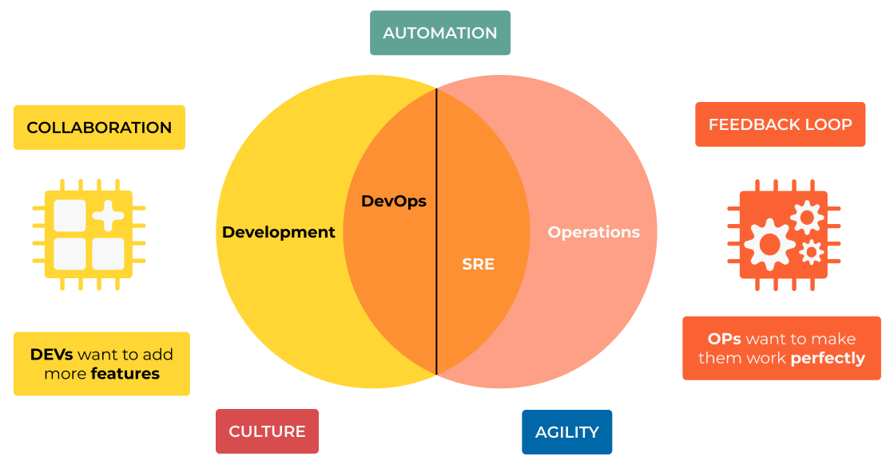
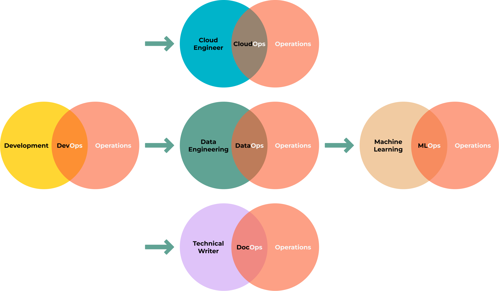

##########################
0.1 Introduction to DevOps
##########################

===============
What is DevOps?
===============

Understanding DevOps is a journey that goes beyond merely mastering tools and technologies. It's about adopting a mindset centered on collaboration, automation, and continuous improvement. At its core, DevOps aims to deliver value to customers more quickly, reliably, and with higher quality. Moreover, it fosters a culture that brings people together, enabling teams to overcome challenges and grow through shared goals and successes.

I believe that a DevOps engineer should be well-rounded—skilled in both building and operating an application. In many ways, this approach is a return to traditional roles, where computer engineers managed everything from hardware to software development. This comprehensive skill set not only provides a deeper understanding of the entire system but also promotes more efficient work, as engineers can see the whole picture and make better decisions.

DevOps means different things to different people:

- **Automation**: For some, it's about automating pipelines and infrastructure.
- **Performance, Scalability, Costs & Security**: For others, it focuses on improving security, system performance, scalability, cost and reliability.
- **Integration**: And for many, it encompasses everything that doesn't fit neatly into either the development or operations category.

Regardless of the perspective, the universal goal of DevOps is to improve the way we work and deliver better results to our customers.

---------------------------------------------
"Explain Like I'm 5" (ELI5) version of DevOps
---------------------------------------------

*Imagine a restaurant. Developers are the chefs, creating the food. Operations engineers are the waiters, delivering the food to customers. DevOps and SREs are like the kitchen staff who wash the vegetables, peel the potatoes, clean the floor—doing the unglamorous but critical work that ensures everything runs smoothly and efficiently.*

.. note::

   **"DevOps is the union of people, process, and products to enable continuous delivery of value to our end users."** — `Donovan Brown <https://www.donovanbrown.com/post/what-is-devops>`_

.. note::

   *Technically, DevOps combines "Development" and "Operations," bridging the gap between software developers and IT operations teams. It emphasizes collaboration, automation, continuous integration, and continuous delivery to create, test, and deploy software faster and more reliably.*

DevOps started in 2009 when Patrick Debois and Andrew Clay Shafer hosted the first DevOpsDays conference in Ghent, Belgium. The conference highlighted the growing need for better collaboration between development and operations teams. Since then, DevOps has evolved into a global movement, embraced by organizations worldwide.

======================
DevOps Core Principles 
======================

DevOps is guided by several fundamental principles:

1. **Continuous Integration (CI)**: Developers frequently merge code changes into a central repository, triggering automated builds and tests to catch issues early.
2. **Continuous Delivery (CD)**: Extending CI, CD involves deploying changes automatically to production-ready environments for rapid releases.
3. **Microservices**: Applications are broken into small, independent services, making them easier to develop, test, deploy, and scale.
4. **Infrastructure as Code (IaC)**: Systems are managed through code, enabling version control, reviews, and repeatability.
5. **Monitoring and Logging**: Continuous system monitoring and logging ensure performance, prevent downtime, and enable rapid issue resolution.
6. **Automation**: Automating repetitive tasks—such as builds, tests, and deployments—minimizes human error and accelerates processes.
7. **Collaboration and Communication**: Fostering close communication across teams ensures alignment and improves outcomes.
8. **Fail Fast, Learn Fast**: Encourages experimentation while minimizing the impact of failures and learning quickly from mistakes.
9. **Security Integration (DevSecOps)**: Security is built into the development lifecycle from the start, not as an afterthought.
10. **Continuous Improvement**: Feedback loops drive iterative enhancement of both processes and products.

=================================
DevOps Patterns and Anti-Patterns
=================================

DevOps patterns are proven practices that help teams succeed in their DevOps journey. They include:

1. **Automated Testing**: Ensures code quality and reliability through automated unit, integration, and end-to-end tests.
2. **Immutable Infrastructure**: Treats infrastructure as disposable, enabling rapid, consistent deployments.
3. **Blue-Green Deployments**: Minimizes downtime by switching between two identical environments during deployments.
4. **Canary Releases**: Gradually rolls out new features to a subset of users to validate changes before full deployment.
5. **Chaos Engineering**: Introduces controlled failures to test system resilience and identify weaknesses.
6. **Feature Flags**: Enables toggling features on and off without deploying new code, reducing risk and enabling rapid rollbacks.
7. **Single Source of Truth**: Ensures consistency by storing configuration and code in a single, version-controlled repository.
8. **Dark Launching**: Tests new features in production without exposing them to users, reducing risk and validating performance.

==============================
What I Do as a DevOps Engineer
==============================

The role of a DevOps engineer varies depending on the company, team, and project, but it generally involves:

1. Supporting teams with the infrastructure and automation they need: building pipelines, integrating tools, and creating new environments.
2. Enhancing security, performance, reliability, and scalability of systems.
3. Mentoring team members and fostering knowledge-sharing.
4. Conducting PoCs (Proof of Concepts) for new tools and technologies and documenting decisions with Architecture Decision Records (ADRs).
5. Managing stakeholders by helping them understand DevOps culture and its benefits.

=============================================
Site Reliability Engineering (SRE) vs. DevOps
=============================================

-------------------------------------------
"Explain Like I'm 5" (ELI5): DevOps vs. SRE
-------------------------------------------

*Imagine a theater production.*

- **DevOps** is like the team that writes the script, directs the play, and sets up the stage and lighting. They ensure the play is ready to run smoothly when it's showtime.
- **SRE** is the backstage crew, handling lighting and sound, fixing issues during the performance, and ensuring the play goes on without a hitch.

While DevOps focuses on streamlining the entire development and deployment process, SRE emphasizes reliability and performance during operations. Both roles often overlap but have distinct missions.

==============
DevOps Flavors
==============

DevOps adapts to specific contexts, leading to specialized "flavors":

1. **CloudOps**: Focused on managing cloud infrastructure using practices like IaC and automation.
2. **DataOps**: Streamlines data engineering and operations to enhance data reliability and accessibility.
3. **DocOps**: Integrates documentation with development and operations workflows, using tools like Sphinx or MkDocs.
4. **MLOps**: Applies DevOps principles to machine learning, ensuring models are trained, tested, and deployed efficiently.
5. **LLMOps**: A subset of MLOps, tailored to managing large language models.

==============
CI/CD Pipeline
==============

A CI/CD pipeline automates the process of delivering code to production. It typically involves seven steps:

#. **Coding**: Develop and review code; manage with tools like Git.
#. **Building**: Convert code into deployable artifacts using tools like Maven or Gradle.
#. **Testing**: Validate functionality, security, and performance with Pytest or JUnit.
#. **Packaging**: Prepare build artifacts for deployment using tools like Docker.
#. **Releasing**: Manage releases with Jenkins or GitHub Actions.
#. **Configuring**: Set up infrastructure with tools like Terraform or Ansible.
#. **Monitoring**: Track application performance with Prometheus or Grafana.

----------------------
Continuous Integration
----------------------

Continuous Integration (CI) involves frequent merging of code changes into a central repository, triggering automated builds and tests. This practice identifies and resolves issues early, enhancing software quality.

-------------------
Continuous Delivery
-------------------

Continuous Delivery (CD) builds on CI by automatically preparing code changes for deployment. This ensures every build is deployment-ready, enabling rapid releases.

.. image:: ../diagrams/ci-cd.png
   :width: 90%
   :align: center
   :alt: CI/CD

