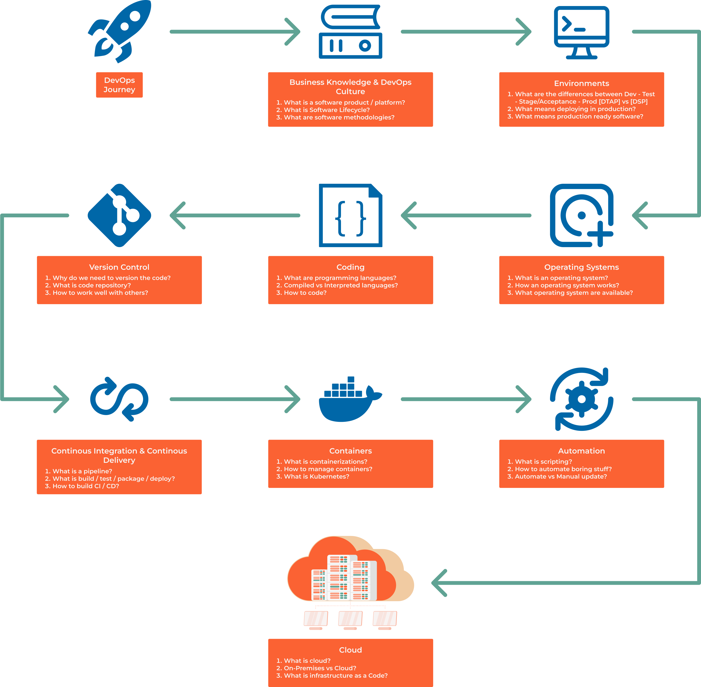

##################
0.2 DevOps Roadmap
##################

The DevOps position requires a broad skillset and the ability to learn new technologies quickly. This roadmap serves as a foundational guide to help you learn the basics and build upon them over time.

In many organizations, a DevOps engineer is expected to be a complete, well-rounded professional. This role involves expertise in a variety of areas, including:

- **Infrastructure**: Setting up and maintaining servers, cloud environments, and virtualized systems.
- **Code**: Writing, debugging, and automating tasks through scripting and programming.
- **Deployment**: Managing CI/CD pipelines to release software efficiently.
- **Monitoring**: Ensuring applications are running smoothly and identifying performance bottlenecks.
- **Security**: Implementing measures to protect systems and data.
- **Networking**: Understanding and configuring networks for reliability and scalability.
- **Databases**: Working with both relational and NoSQL databases.
- **Collaboration**: Communicating effectively with teams to align goals and processes.
- **Soft Skills**: Giving and receiving feedback, time management, and learning how to adapt to change.

=======================================
Why is Linux Knowledge Still Mandatory?
=======================================

Released on September 17, 1991, Linux remains the backbone of modern technology. Almost everything, your phone, car, TV, heating system, company servers, cloud platforms, and even banking systems, relies on Linux.

Being comfortable with Linux is a **must-have skill** for any DevOps engineer. This includes:

- Navigating the terminal.
- Understanding the file system, processes and services.
- Debugging issues.
- Writing shell scripts to automate tasks.

========================================
Why is Coding Knowledge Still Mandatory?
========================================

While advancements in AI and low-code/no-code tools are simplifying some processes, the ability to write and understand code remains crucial. As NVIDIA CEO Jensen Huang said:

.. note::
   
   "It is our job to create computing technology such that nobody has to program. And that the programming language is human."

While this future may be approaching, we are not there yet. Proficiency in programming allows you to:

- Automate repetitive tasks.
- Debug issues effectively.
- Contribute to infrastructure as code (IaC) initiatives.

A DevOps engineer must be a "jack of all trades, master of one." This means having broad knowledge across domains but mastering one specialty.

==================================
Essential Skills Beyond Technology
==================================

Being a successful DevOps engineer requires more than technical expertise. Here are some critical soft skills to develop:

1. **How to Work**:

   - Organize your tasks and prioritize effectively.
   - Focus on continuous improvement—when something works, ask how it can be better. When something fails, identify the root cause and fix it.

2. **How to Learn**:

   - Time is limited; focus on learning skills that provide the most value.
   - Test new technologies and experiment to broaden your knowledge.

3. **How to Communicate**:

   - DevOps is a team sport. Learn to collaborate, share ideas, and resolve conflicts.
   - Practice giving and receiving constructive feedback.
   - Know how to ask for help and how to say no diplomatically.

4. **Career Navigation**:

   - Recognize when it's time for a career change or role adjustment to continue growing.

=============
Prerequisites
=============

To build a solid foundation in DevOps, you need to master the following:

1. **Understanding Systems**:

   - How does software work? How does the internet work? Identify potential problems.

2. **Operating Systems**:

   - Master Linux (command line, permissions, file systems).
   - Familiarize yourself with Windows for cross-platform tasks.

3. **Programming Languages**:

   - Python: For scripting and automation.
   - Go: For performance-critical tools.

4. **Networking and Security**:

   - OSI Model: Learn how data moves through a network.
   - LAN/VPN: Understand local and private networks.
   - HTTP/HTTPS: Dive into web communication.
   - Firewalls and Proxies: Configure them for secure access.
   - Certificates and Keys: Manage SSL/TLS for encryption.
   - Load Balancers and Reverse Proxies: Distribute traffic efficiently.

5. **Server Management**:

   - Web Servers vs Application Servers: Learn their differences and uses.
   - Configuration Management: Automate server configurations with tools like Ansible.

6. **Databases**:

   - SQL vs NoSQL: Understand their strengths and when to use each.

7. **Environments**:

   - Explore BareMetal, Virtual Machines, Containers, Pods, and Cloud setups.

8. **Orchestration and Automation**:

   - Scripting: Learn Bash or PowerShell for quick automation.
   - Configuration Management: Use Ansible to standardize environments.
   - Container Orchestration: Dive into Kubernetes and Docker.
   - Infrastructure as Code (IaC): Manage infrastructure with Terraform.
   - CI/CD: Master tools like GitHub Actions and GitLab CI.

9. **Monitoring and Logging**:

   - Learn what metrics to monitor and how to set up effective dashboards and alerts.

10. **Software Methodologies**:

   - Understand Agile, Scrum, Kanban, and DevOps methodologies.

==============
DevOps Roadmap
==============

The journey to becoming a DevOps engineer can feel overwhelming. Here's a step-by-step roadmap to guide you:

1. **Business Knowledge & DevOps Culture**:

   - Understand the business value of DevOps.
   - Learn the principles of collaboration, automation, and feedback.

2. **Environments**:

   - Gain hands-on experience with virtual machines, containers, and cloud platforms.

3. **Operating Systems**:

   - Master Linux and familiarize yourself with other systems like Windows.

4. **Coding**:

   - Learn a programming language like Python for scripting and automation.

5. **Git**:

   - Practice version control to collaborate effectively with your team.

6. **CI/CD**:

   - Build and deploy pipelines using tools like Jenkins or GitHub Actions.

7. **Containers**:

   - Work with Docker to containerize applications and with Kubernetes for orchestration.

8. **Automation**:

   - Use tools like Ansible and Terraform to automate repetitive tasks.

9. **Cloud**:

   - Learn to deploy and manage applications on AWS, Azure, or Google Cloud.

============
Course Goals
============

By the end of this course, you will:

1. **Master Key Tools**:

   - Gain confidence with Linux, Docker, Kubernetes, Git, and Cloud platforms.

2. **Learn to Code and Find Information**:

   - Develop the ability to automate tasks and troubleshoot issues independently.

3. **Work Effectively with Teams**:

   - Build collaboration and communication skills for a team-oriented environment.

4. **Acquire Best Practices**:

   - Learn industry standards for infrastructure, deployment, and monitoring.

5. **Build a Portfolio**:

   - Complete hands-on projects to showcase your skills on your resume.

