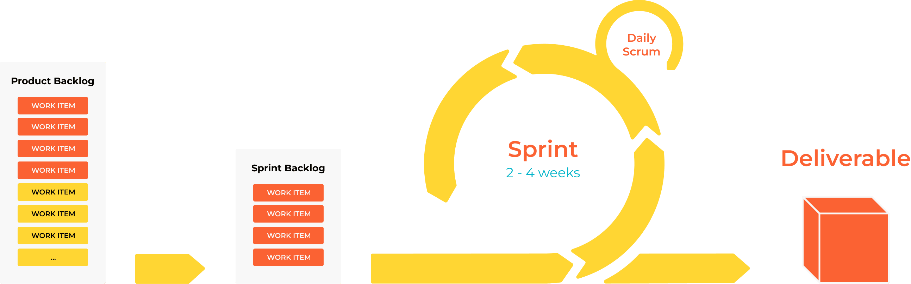

###############
0.4 SCRUM Agile
###############

===============
Agile Manifesto
===============

  We are uncovering better ways of developing

  software by doing it and helping others do it.
  
  Through this work we have come to value:

.. note::

  **Individuals and interactions** over processes and tools

  **Working software** over comprehensive documentation

  **Customer collaboration** over contract negotiation

  **Responding to change** over following a plan

That is, while there is value in the items on the right, we value the items on the left more.

The Agile methodology is rooted in these principles. It promotes a mindset that adapts to change, focuses on collaboration, and prioritizes delivering value to customers. Agile fosters an environment where teams can innovate, evolve, and respond effectively to challenges.

================
What is Agile?
================

Agile is not a single methodology but a collection of principles and practices aimed at iterative and incremental development. It seeks to address the challenges of traditional project management approaches like the **Waterfall model**, which rely heavily on upfront planning and strict phase completion.

Agile emphasizes:

- Delivering small, working pieces of software frequently.
- Adapting plans and priorities based on feedback.
- Encouraging close collaboration between teams and stakeholders.
- Empowering teams to self-organize and make decisions.

===============
Key Principles
===============

Agile development operates on a set of guiding principles, enabling teams to work effectively and adapt to change:

1. **Iterative and Incremental**:

   - Agile breaks down large projects into manageable pieces, called **increments**, which are developed and delivered in **iterations**.
   - Each iteration includes planning, development, testing, and delivery, allowing frequent feedback loops.

2. **Collaboration**:

   - Close collaboration between team members and stakeholders ensures alignment.
   - Developers, customers, and managers share ownership of decisions, reducing silos.

3. **Self-Organizing Teams**:

   - Teams are empowered to decide the best way to deliver functionality.
   - This fosters accountability, innovation, and efficiency.

4. **Flexibility**:

   - Agile is designed to handle changing requirements, even late in the development process.
   - Teams adapt to new business needs without derailing the project.

5. **Customer Satisfaction**:

   - By involving customers throughout the development cycle, Agile ensures the end product meets user needs.
   - Regular delivery of functional software provides immediate value.

6. **Continuous Improvement**:

   - Agile incorporates lessons learned in each iteration to improve processes, practices, and outcomes.

7. **Lightweight Documentation**:

   - Focuses on just enough documentation to support development while avoiding overhead.

============================
Scrum: A Practical Framework
============================

.. note::

   **Scrum** is a lightweight framework designed to help teams solve complex problems while delivering high-value products efficiently and creatively.

In Scrum, roles, events, and artifacts work together to create a structured yet flexible framework:

++++++++++++++++++
Key Roles in Scrum
++++++++++++++++++

1. **Product Owner**:

   - Represents stakeholders and customers.
   - Maintains the **Product Backlog**, prioritizing tasks based on value and feedback.

2. **Scrum Master**:

   - Acts as a facilitator, ensuring the team adheres to Scrum principles.
   - Removes impediments, enabling the team to focus on delivering value.

3. **Scrum Team**:

   - A cross-functional team of developers, testers, and other roles working collaboratively.
   - Responsible for delivering a **Product Increment** during each Sprint.

+++++++++++++++++++
Key Events in Scrum
+++++++++++++++++++

1. **Sprint Planning**:

   - The team decides which items from the Product Backlog they will complete during the Sprint.
   - Establishes a **Sprint Goal** that aligns with project priorities.

2. **Daily Scrum (Stand-Up)**:

   - A short, time-boxed meeting (15 minutes) where team members share:
     - What they did yesterday.
     - What they plan to do today.
     - Any obstacles they're facing.

3. **Sprint Review**:

   - Held at the end of the Sprint to showcase completed work to stakeholders.
   - Gathers feedback to inform future iterations.

4. **Sprint Retrospective**:

   - A team meeting to reflect on the Sprint and identify areas for improvement.
   - Focuses on enhancing processes and team dynamics.

++++++++++++++++++++++
Key Artifacts in Scrum
++++++++++++++++++++++

1. **Product Backlog**:

   - A prioritized list of features, fixes, and improvements maintained by the Product Owner.
   - Items can be added or re-prioritized as needed.

2. **Sprint Backlog**:

   - A subset of the Product Backlog selected for the current Sprint.
   - Includes specific tasks needed to achieve the Sprint Goal.

3. **Increment**:

   - The usable, potentially shippable product delivered at the end of a Sprint.
   - Represents progress toward the project's overall goals.

=========================
How Scrum Works in Action
=========================

1. **The Product Owner** identifies high-value features and prioritizes them in the Product Backlog.
2. **The Scrum Team** selects a manageable chunk of work during Sprint Planning and commits to delivering it by the end of the Sprint.
3. Throughout the Sprint, the team holds **Daily Scrums** to track progress and address obstacles.
4. At the end of the Sprint, the team delivers a **Product Increment** and presents it during the **Sprint Review**.
5. The team reflects on their process during the **Sprint Retrospective**, identifying ways to improve in the next Sprint.
6. The cycle repeats, with new items added or reprioritized in the Product Backlog as needed.

================================
Agile vs. Traditional Approaches
================================

========================  ===============================  ===============================
Aspect                    Agile                            Traditional (Waterfall)
========================  ===============================  ===============================
**Planning**              Iterative, adaptive              Upfront, rigid
**Delivery**              Frequent, incremental            Single-phase, big release
**Requirements**          Evolving                         Fixed
**Team Structure**        Collaborative, cross-functional  Silos, specialized roles
**Customer Involvement**  Continuous                       Limited to the start/end
**Flexibility**           High                             Low
**Documentation**         Lightweight, minimal             Heavy, comprehensive
========================  ===============================  ===============================

====================
Why Use Agile/Scrum?
====================

1. **Faster Feedback Loops**:

   - Delivering small, functional increments allows teams to gather feedback early and often.
   - Reduces the risk of building the wrong product.

2. **Higher Customer Satisfaction**:

   - Continuous collaboration ensures the product meets user needs.

3. **Improved Team Dynamics**:

   - Self-organizing teams foster ownership, creativity, and accountability.

4. **Adaptability**:

   - Responding to change ensures projects stay aligned with evolving business goals.

5. **Increased Quality**:

   - Iterative testing and continuous improvement enhance product quality.

6. **Greater Transparency**:

   - Frequent meetings and visible progress promote trust and alignment among stakeholders.
