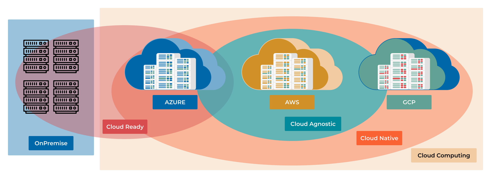

########################################
11.1 Cloud Strategy: Native vs. Agnostic
########################################

So far, you've learned how to package applications into containers with Docker and manage them at scale with Kubernetes. You've even built CI/CD pipelines to automate the whole process.

The next logical question is: **Where do we run all this?**

This chapter explores the two dominant strategies for deploying applications in the cloud: **Cloud Native** and **Cloud Agnostic**. Understanding these approaches is crucial for making architectural decisions that will impact your application's performance, cost, and flexibility for years to come.

===================
Learning Objectives
===================

By the end of this chapter, you will be able to:

*   **Differentiate** between Cloud Native and Cloud Agnostic strategies.
*   **Connect** cloud service models (IaaS, PaaS, SaaS) to your hands-on experience.
*   **Recognize** how your work with Docker and Kubernetes fits into the Cloud Native landscape.
*   **Evaluate** the trade-offs of tying your application to a specific cloud provider versus keeping it portable.
*   **Choose** the right strategy for different project requirements, from a fast-moving startup to a large enterprise.

===================================================
The Foundation: Understanding Cloud Services (XaaS)
===================================================

Before we dive into "Native" vs. "Agnostic," let's clarify what "cloud services" are. Think of them as the building blocks provided by companies like AWS, Azure, and GCP. These blocks come in different levels of abstraction, often called the "as a Service" models.

.. note::
    A **cloud service** is any IT resource—from virtual servers to AI algorithms—delivered on-demand over the internet with pay-as-you-go pricing.

Let's relate these models to the tools you've already used.

--------------------------------------
**Infrastructure as a Service (IaaS)**
--------------------------------------

This is the most basic building block. The provider gives you raw computing infrastructure: virtual machines (VMs), networking, and storage.

*   **Analogy:** Renting an empty plot of land. You can build whatever you want, but you're responsible for the entire structure.
*   **Examples:** AWS EC2, Azure Virtual Machines, GCP Compute Engine.
*   **Your Experience:** If you installed Docker on a bare VM from a cloud provider, you were using IaaS. You managed the OS, the Docker runtime, and your application containers.

--------------------------------
**Platform as a Service (PaaS)**
--------------------------------

This layer adds more abstraction. The provider manages the underlying infrastructure *and* the runtime environment, letting you focus on your application code and data.

*   **Analogy:** Renting a fully equipped workshop. The tools and electricity are ready; you just bring your project and get to work.
*   **Examples:** AWS Elastic Beanstalk, Azure App Service, Google App Engine.
*   **Your Experience:** Managed Kubernetes services like **EKS (AWS), AKS (Azure), and GKE (GCP)** are a form of PaaS (often called CaaS - Containers as a Service). The provider handles the complex task of managing the Kubernetes control plane, so you can focus on deploying your ``.yaml`` files.

--------------------------------
**Software as a Service (SaaS)**
--------------------------------

This is a complete, ready-to-use application delivered over the web. You don't manage anything except your data and user configuration.

*   **Analogy:** Taking a taxi. You don't own the car or hire the driver; you just pay for the ride to your destination.
*   **Examples:** GitHub, Google Workspace, Office 365, Slack.
*   **Your Experience:** You've been using SaaS tools throughout this course! GitHub is a perfect example.

.. code-block:: text

   Shared Responsibility Model: Who Manages What?
   
   ┌──────────────────┬─────────────┬──────────┬──────────┬──────────┐
   │                  │ On-Premises │   IaaS   │   PaaS   │   SaaS   │
   ├──────────────────┼─────────────┼──────────┼──────────┼──────────┤
   │ Application      │     You     │   You    │   You    │ Provider │
   │ Data             │     You     │   You    │   You    │ Provider │
   │ Runtime          │     You     │   You    │ Provider │ Provider │
   │ Operating System │     You     │   You    │ Provider │ Provider │
   │ Virtualization   │     You     │ Provider │ Provider │ Provider │
   │ Servers          │     You     │ Provider │ Provider │ Provider │
   │ Storage          │     You     │ Provider │ Provider │ Provider │
   │ Networking       │     You     │ Provider │ Provider │ Provider │
   └──────────────────┴─────────────┴──────────┴──────────┴──────────┘

==================================================
Strategy 1: Cloud Native - Embracing the Ecosystem
==================================================

.. note::
    **Cloud Native** is an approach to building and running applications that fully leverages the advantages of a cloud computing environment. It's not about *where* you deploy, but *how* you design, build, and operate your software.

The exciting part? **You have already been practicing Cloud Native principles!**

The core pillars of Cloud Native directly map to the skills you've developed:

**1. Microservices Architecture**
   Instead of a single, monolithic application, you build a system from small, independent services. This makes the system easier to scale, update, and maintain.

**2. Containerization (Your Docker Skills)**
   You package each microservice with its dependencies into a lightweight, portable container. This ensures your application runs consistently everywhere. Your ``Dockerfile`` is the blueprint for this process.

   .. code-block:: dockerfile
      :caption: A Cloud Native Dockerfile
      :name: cloud-native-dockerfile

      # Use a minimal, secure base image
      FROM python:3.11-slim

      WORKDIR /app

      # Isolate dependencies
      COPY requirements.txt .
      RUN pip install --no-cache-dir -r requirements.txt

      COPY . .

      # Run as a non-root user for better security
      RUN useradd --uid 1001 --gid 0 appuser
      USER appuser

      # Expose the port and define the runtime command
      EXPOSE 8000
      CMD ["python", "app.py"]

**3. Dynamic Orchestration (Your Kubernetes Skills)**
   You use a container orchestrator like Kubernetes to automatically manage your application's lifecycle. This provides self-healing, auto-scaling, and zero-downtime deployments. Your ``deployment.yaml`` is where you declare your desired state.

   .. code-block:: yaml
      :caption: A Cloud Native Kubernetes Deployment
      :name: cloud-native-k8s-deployment

      apiVersion: apps/v1
      kind: Deployment
      metadata:
        name: my-python-app
      spec:
        replicas: 3 # Start with 3 instances for high availability
        selector:
          matchLabels:
            app: my-python-app
        template:
          metadata:
            labels:
              app: my-python-app
          spec:
            containers:
            - name: web-server
              image: my-registry/my-python-app:v1.2.0
              ports:
              - containerPort: 8000
              # Health checks are vital for self-healing
              livenessProbe:
                httpGet:
                  path: /health
                  port: 8000
                initialDelaySeconds: 15
                periodSeconds: 20
              # Define resource requests and limits to ensure stability
              resources:
                requests:
                  memory: "64Mi"
                  cpu: "100m" # 0.1 CPU core
                limits:
                  memory: "128Mi"
                  cpu: "250m" # 0.25 CPU core

**4. Automation & CI/CD (Your Pipelines Skills)**
   You build automated pipelines to test and deploy every change, enabling rapid and reliable updates. Your GitHub Actions workflows are a perfect example of this.

**The Deal with Cloud Native: Speed and Power**
By going "all-in" on a single cloud provider (e.g., AWS), you gain access to their entire suite of powerful, managed services.

*   **Database:** Instead of running your own PostgreSQL in a container, you use **AWS RDS** or **DynamoDB**.
*   **Messaging:** Instead of setting up your own Kafka or RabbitMQ cluster, you use **AWS SQS** or **SNS**.
*   **AI/ML:** You get direct access to cutting-edge services like **AWS SageMaker** or **GCP Vertex AI**.

This allows you to build sophisticated systems incredibly fast because the provider handles the heavy lifting of managing the underlying services.

**When to Choose Cloud Native:**
*   **Speed is critical:** You're a startup that needs to launch an MVP yesterday.
*   **Deep integration needed:** Your application relies heavily on specialized services like AI/ML, big data analytics, or serverless functions.
*   **Small team:** You want to focus on building features, not managing infrastructure.

**The Risk:** **Vendor Lock-in**. By building your application around proprietary services, you make it very difficult and expensive to move to another cloud provider later.

====================================================
Strategy 2: Cloud Agnostic - Freedom and Flexibility
====================================================

.. note::
    **Cloud Agnostic** is an approach to designing applications that can run on any cloud provider's infrastructure without significant modification. The goal is to avoid vendor lock-in and maintain maximum flexibility.

Think of this as the "universal adapter" strategy. You intentionally choose tools and technologies that are not tied to any single provider.

**The Core Principle: Abstraction**
The key to being cloud agnostic is to rely on open standards and add abstraction layers that hide the differences between clouds.

**How to Achieve It:**

**1. Rely on Open-Source & Standards**
   You prioritize technologies that are industry standards and run everywhere.
   *   **Orchestration:** **Kubernetes** is the ultimate cloud-agnostic tool. It provides a consistent API layer across AWS (EKS), Azure (AKS), and GCP (GKE).
   *   **Databases:** Use **PostgreSQL**, **MySQL**, or **MongoDB** running in containers on your Kubernetes cluster, rather than a provider-specific database service.
   *   **Monitoring:** Use **Prometheus** and **Grafana** instead of AWS CloudWatch or Azure Monitor.

**2. Use Multi-Cloud IaC Tools**
   You define your infrastructure using tools that can deploy to multiple clouds from a single codebase.
   *   **Terraform** is the prime example. You can write modules that provision a Kubernetes cluster and its supporting resources on any cloud, just by changing a variable.

   .. code-block:: hcl
      :caption: Multi-Cloud Terraform Configuration
      :name: multi-cloud-terraform

      # main.tf
      # This one file can deploy to AWS, Azure, or GCP
      # by changing the "cloud_provider" variable.

      terraform {
        required_providers {
          aws = {
            source  = "hashicorp/aws"
            version = "~> 5.0"
          }
          azurerm = {
            source  = "hashicorp/azurerm"
            version = "~> 3.0"
          }
          google = {
            source  = "hashicorp/google"
            version = "~> 5.0"
          }
        }
      }

      variable "cloud_provider" {
        description = "Target cloud: 'aws', 'azure', or 'gcp'"
        default     = "aws"
      }

      # Provision a Kubernetes cluster using a provider-specific module
      module "kubernetes_cluster" {
        source = "./modules/${var.cloud_provider}" # e.g., ./modules/aws

        cluster_name    = "my-agnostic-cluster"
        node_count      = 3
      }

      # To deploy:
      # terraform apply -var="cloud_provider=aws"
      # terraform apply -var="cloud_provider=azure"

**The Deal with Cloud Agnostic: Control and Portability**
This approach gives you the freedom to move workloads between clouds to optimize for cost, performance, or regional availability. It also gives you negotiating power with providers.

**When to Choose Cloud Agnostic:**
*   **Avoiding lock-in is a priority:** You're a large enterprise or in a regulated industry where you need to de-risk your cloud strategy.
*   **Multi-cloud is a requirement:** You need to run in different regions for data sovereignty laws (e.g., GDPR in Europe) or for disaster recovery.
*   **Cost optimization:** You want to be able to move workloads to whichever cloud is cheapest at any given time.

**The Cost:** **Increased Complexity and Overhead**. Your team is now responsible for managing more of the stack (like the database cluster), and you miss out on the cutting-edge, managed services that a native approach offers.

====================================
Decision Framework: Which to Choose?
====================================

There is no single "best" answer. The right choice depends entirely on your project's context.

.. code-block:: text

   ┌─────────────────┬──────────────────────────┬──────────────────────────┐
   │      Factor     │       Cloud Native       │      Cloud Agnostic      │
   ├─────────────────┼──────────────────────────┼──────────────────────────┤
   │ Time to Market  │ Faster                   │  Slower                  │
   │ Performance     │ Optimized                │  Good Enough             │
   │ Innovation      │ Access to latest tech    │Relies on open-source     │
   │ Flexibility     │ Low (Vendor Lock-in)     │  High (Portable)         │
   │ Operational Cost│ Lower (Managed)          │  Higher (Self-Managed)   │
   │ Team Complexity │ Simpler                  │  More Complex            │
   └─────────────────┴──────────────────────────┴──────────────────────────┘

**Scenario 1: The FinTech Startup**
*   **Goal:** Launch a new payment app in 3 months.
*   **Team:** 4 developers.
*   **Priority:** Speed and security.
*   **Decision:** **Cloud Native**. Use a provider like AWS and leverage their managed services for databases (RDS), authentication (Cognito), and PCI-compliant infrastructure. This lets the small team focus on the core payment logic instead of reinventing the wheel.

**Scenario 2: The Global Retailer**
*   **Goal:** Modernize an e-commerce platform while controlling costs.
*   **Team:** 100+ engineers.
*   **Priority:** Avoid lock-in, optimize costs across regions, and maintain high availability.
*   **Decision:** **Cloud Agnostic**. Build on top of Kubernetes and use Terraform to deploy to both AWS and GCP. This allows them to route traffic to the cheapest region and provides a robust disaster recovery strategy. If one cloud has an outage, they can fail over to the other.

========================================
The Pragmatic Reality: A Hybrid Approach
========================================

For many companies, the best strategy isn't a pure choice but a **hybrid**.

You can build the core of your application using cloud-agnostic principles (Kubernetes, PostgreSQL, etc.) to maintain flexibility. Then, for specific, non-critical features, you can strategically use cloud-native services to accelerate development.

**Example:** A media company might run its core content management system on a Kubernetes cluster (agnostic) but use AWS's specialized MediaConvert service (native) for video transcoding because it's the best and most cost-effective tool for that specific job.

=============
Key Takeaways
=============

*   **Cloud Native = Speed and Power.** You fully embrace one provider's ecosystem to build faster and leverage their most advanced tools. Your existing Docker and Kubernetes skills are the foundation of this approach.
*   **Cloud Agnostic = Flexibility and Control.** You use open standards like Kubernetes and Terraform to build portable applications that can run on any cloud, avoiding vendor lock-in.
*   **It's a Trade-Off.** You are balancing the speed and innovation of Cloud Native against the freedom and long-term flexibility of Cloud Agnostic.
*   **Start with Why.** The right choice depends on your business goals, team size, and risk tolerance. There is no universally correct answer.
*   **Hybrid is often the answer.** Don't be afraid to mix and match, using agnostic principles for your core application and native services for specialized tasks.
