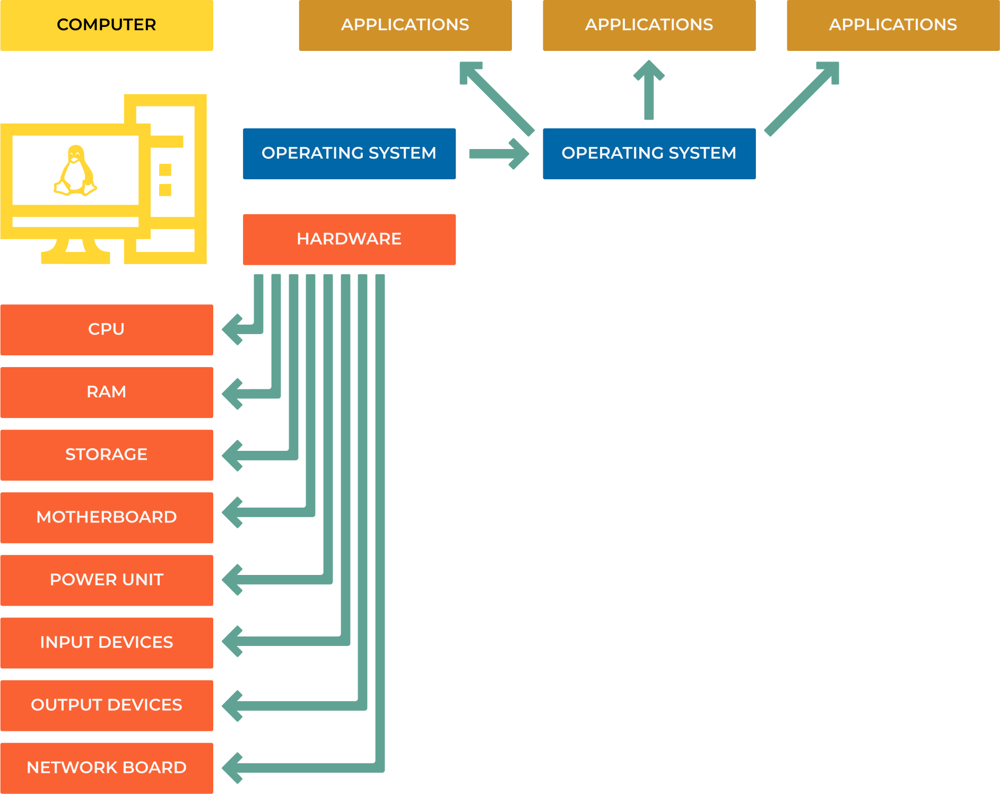
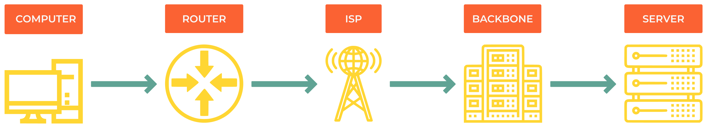

###############################
1.0 Computer and Network Basics
###############################

Understanding how computers and networks work is essential for DevOps engineers. This chapter covers the fundamental concepts you need to know.

========
Computer
========

Think of a computer like a highly organized office building where different departments work together to complete tasks.

-------------------
Hardware Components
-------------------

**Central Processing Unit (CPU)**

    The "brain" that executes instructions. Like a super-fast calculator that can perform billions of operations per second.
    
    *Example*: When you click a button in an app, the CPU processes that click and decides what should happen next.

**Memory (RAM and Storage)**

    - **RAM (Random Access Memory)**: Think of it as your desk workspace - it holds information you're actively working with. When you close an application, this data disappears.
    - **Storage (HDD/SSD)**: Like filing cabinets that keep your documents even when the power is off.
    
    *Analogy*: RAM is like papers on your desk (fast access, but temporary), while storage is like a filing cabinet (slower access, but permanent).

**Other Essential Components**

    - **Motherboard**: The office building that connects all departments
    - **Power Supply**: The electrical system powering everything
    - **GPU (Graphics Card)**: Specialized department for handling visual tasks
    - **Input/Output Devices**: Ways to communicate with the outside world (keyboard, mouse, monitor)

.. note::

    **Real-world example**: When you open a program like a web browser:

    1. CPU reads the program from storage
    2. Loads it into RAM for quick access
    3. GPU helps render the visual interface
    4. You interact through input devices

---------------
Software Layers
---------------

Software works in layers, like floors in an office building:

**Operating System (OS)**

    The building manager that coordinates everything. Examples: Windows, macOS, Linux, Android.
    
    *What it does*: Manages hardware, runs programs, handles files, provides security.

**Application Software**

    The actual workers doing specific jobs: web browsers, text editors, games, databases.
    
    *Example*: When you use Chrome (application), it asks the OS to display windows, access the internet, and store bookmarks.

**Drivers & Firmware**

    - **Drivers**: Translators that help the OS talk to hardware
    - **Firmware**: Basic instructions built into hardware components
    
    *Analogy*: Drivers are like interpreters helping departments communicate in different languages.

========
Networks
========

A network is like a postal system that lets computers send messages to each other. Instead of physical mail, they send digital data.

-----------------
Types of Networks
-----------------

**Local Area Network (LAN)**

    Connects devices in a small area like your home or office.
    
    *Example*: Your laptop, phone, and smart TV all connected to your home WiFi router.

**Wide Area Network (WAN)**

    Connects devices across large distances. The Internet is the biggest WAN.
    
    *Example*: Sending an email from New York to Tokyo uses multiple WANs.

**Personal Area Network (PAN)**

    Very short-range connections, usually wireless.
    
    *Example*: Bluetooth connection between your phone and wireless earbuds.

**Metropolitan Area Network (MAN)**

    Covers a city or large campus.
    
    *Example*: A university network connecting all campus buildings.

----------------------
How the Internet Works
----------------------

The Internet is like a global highway system for data:

.. code-block:: 

    Your Device → Home Router → Internet Service Provider (ISP) → 
    Internet Backbone → Destination Server

**Step-by-step example**: Loading a website

1. You type "google.com" in your browser
2. Your computer asks your router "Where is google.com?"
3. Router asks your ISP's DNS server
4. DNS server responds with Google's IP address
5. Your request travels through multiple networks to reach Google's servers
6. Google sends the webpage back through the same path

.. note::
    
    **Try this**: Open a terminal and run ``traceroute google.com`` to see the actual path your data takes to reach Google!

=========================================
Addressing: How Computers Find Each Other
=========================================

Computers use two types of addresses, like having both a home address and a social security number.

-----------------------------
IP Addresses vs MAC Addresses
-----------------------------

.. code-block:: bash

    # See your network information
    ip addr show
    # or shorter version
    ip a

**IP Address (Logical Address)**

    Like your home address - can change when you move to a different network.
    
    *Example*: 192.168.1.100 (at home) vs 10.0.1.50 (at work)
    
    *Purpose*: Routes data across networks to find the right destination.

**MAC Address (Physical Address)**

    Like your fingerprint - unique to each network card and doesn't change.
    
    *Example*: 00:1A:2B:3C:4D:5E
    
    *Purpose*: Identifies devices on the same local network.

.. note::

    **Analogy**: IP addresses are like postal addresses (change when you move), while MAC addresses are like your DNA (always the same).

------------------------------
Private vs Public IP Addresses
------------------------------

**Private IP Addresses (Internal Use)**
These are like apartment numbers within a building - they only make sense inside that building.

===============  =================================  ==============================
Address Range    Usage                              Example
===============  =================================  ==============================
10.0.0.0/8       Large organizations                10.0.0.1 - 10.255.255.254
172.16.0.0/12    Medium-sized networks              172.16.0.1 - 172.31.255.254  
192.168.0.0/16   Home/small office networks         192.168.0.1 - 192.168.255.254
127.0.0.1        Loopback (your own computer)       Always 127.0.0.1 (localhost)
===============  =================================  ==============================

**Public IP Addresses**
Like your building's street address - unique worldwide and accessible from the Internet.

*Example*: When you visit a website, you're connecting to its public IP address.

-----------------------------------
IPv4 vs IPv6: The Address Evolution
-----------------------------------

**IPv4 (Current Standard)**

    - Format: Four numbers separated by dots
    - Example: ``8.8.8.8`` (Google's DNS server)
    - Problem: Only ~4.3 billion possible addresses (not enough for everyone!)

.. code-block:: text

    IPv4 Binary Representation:
    8.8.8.8 = 00001000.00001000.00001000.00001000

**IPv6 (Future Standard)**

    - Format: Eight groups of hexadecimal numbers
    - Example: ``2001:0db8:0000:0000:1234:0ace:6006:001e``
    - Solution: 340 undecillion addresses (enough for every grain of sand on Earth!)

.. note::

    **Why the change?** We're running out of IPv4 addresses! IPv6 provides enough addresses for every device on the planet to have multiple unique addresses.

==================
Practical Examples
==================

**Example 1: Home Network Setup**

.. code-block:: text

    Internet (Public IP: 203.0.113.1)
           ↓
    Router/Modem (Gateway: 192.168.1.1)
           ↓
    Home Devices:
    - Laptop: 192.168.1.100
    - Phone: 192.168.1.101  
    - Smart TV: 192.168.1.102

**Example 2: Checking Your Network**

.. code-block:: bash

    # Find your IP address
    ip addr show | grep inet
    
    # Test connectivity to Google
    ping 8.8.8.8
    
    # See the route to a website
    traceroute github.com
    
    # Check your public IP
    curl ifconfig.me

**Example 3: Understanding Network Troubleshooting**

When a website doesn't load, the problem could be at different layers:

1. **Physical**: Is your ethernet cable plugged in?
2. **Network**: Can you ping your router? (``ping 192.168.1.1``)
3. **Internet**: Can you reach external sites? (``ping 8.8.8.8``)
4. **DNS**: Can you resolve domain names? (``nslookup google.com``)
5. **Application**: Is the specific service working?

=============
Key Takeaways
=============

1. **Computers** are collections of hardware managed by software layers
2. **Networks** connect computers so they can communicate
3. **IP addresses** route data across networks (like postal addresses)
4. **MAC addresses** identify devices on local networks (like fingerprints)
5. **The Internet** is a global network of interconnected smaller networks
6. **Private IPs** are for internal use, **public IPs** are for Internet communication

.. note::

    **Next Steps**: 
    
    - Experiment with network commands like ``ping``, ``traceroute``, and ``ip addr``
    - Set up a simple home network to see these concepts in action
    - Learn about network protocols (HTTP, DNS, etc.) in the next chapter
