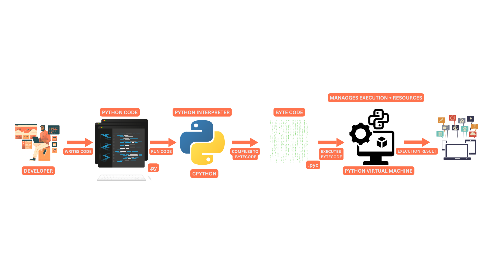
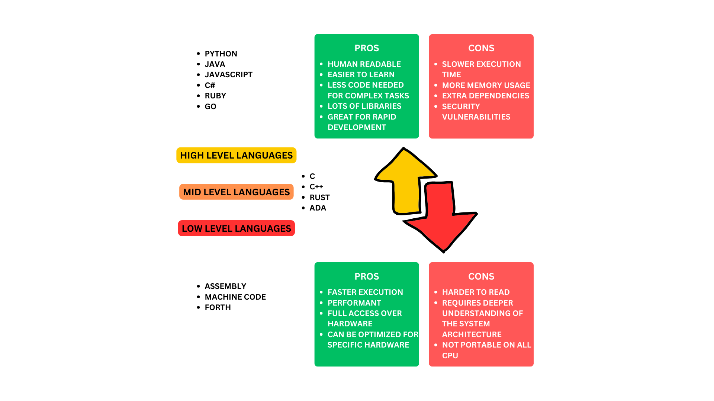

##################
1.1 How code works
##################

.. note::

    Code is a set of instructions that a computer can understand and execute. It is written in a programming language, such as Python, Java, C++, etc. These languages provide a set of rules and syntax that programmers use to write their code.

===============================================
What Happens to Code from Writing to Execution?
===============================================

When a programmer writes code, they are creating a set of instructions that tell the computer what to do. However, computers do not understand high-level programming languages like Python, Java, or Go directly. The code must go through several steps before it can be executed by the computer's processor.

1. **Writing the Code** (Source Code)

- The programmer writes human-readable code in a high-level programming language (e.g., Python, Java, Go).
- This code needs to be translated into machine language (binary code) so the computer can execute it.

2. **Code Translation**: Compilation vs. Interpretation

Different programming languages use different methods to translate code into machine-executable form:

  A. **Compiled Languages** (e.g., C, C++)

  - A compiler translates the entire source code into machine code before execution.
  - The compiler may generate assembly code as an intermediate step, which is then converted into machine code.
  - The final output is an executable file that the computer can run directly.

  B. **Interpreted Languages** (e.g., Python, JavaScript)

  - An interpreter reads and executes the code line by line at runtime.
  - The translation happens dynamically, which makes interpreted languages generally slower than compiled ones.

  C. **Hybrid Languages** (e.g., Java, C#)
  
  - The code is first translated into an intermediate representation (e.g., Java bytecode).
  - A virtual machine (e.g., JVM for Java) executes this intermediate code.

3. **Machine Code Execution**

Once the code is translated into machine code:

  - The CPU fetches, decodes, and executes the binary instructions.
  - Each instruction tells the processor to perform a specific operation (e.g., arithmetic calculations, memory access, or I/O operations).

4. **Memory and I/O Interaction**

- The program interacts with RAM to store and retrieve data.
- It communicates with input/output devices such as the keyboard, mouse, and display.
- If needed, it accesses files or databases on storage devices.

5. The Role of the **Operating System**

- The operating system (OS) manages program execution by allocating resources (CPU, memory, disk access).
- It ensures that multiple programs can run simultaneously without interfering with each other.
- The OS also handles system security and process scheduling.

===========================================
High level languages vs low level languages
===========================================

.. note:: 

  strace is a powerful diagnostic, debugging, and instructional tool in Linux that allows you to monitor the system calls and signals that a program makes and receives during its execution.

.. code-block:: bash

  strace -ls

  # 1. Executing ls
  execve("/usr/bin/ls", ["ls"], 0x7fff674cf020) = 0
  # Runs the ls command.
  
  # 2. Loading Shared Libraries
  openat("/etc/ld.so.cache", O_RDONLY) = 3
  openat("/lib64/libc.so.6", O_RDONLY) = 3
  # Opens the dynamic linker cache and loads necessary libraries like libc.so.6 (C standard library).
  
  # 3. Checking Terminal Settings
  ioctl(1, TIOCGWINSZ, {ws_row=53, ws_col=126}) = 0
  # Gets the terminal size for formatting output.
  
  # 4. Reading the Directory
  openat(".", O_RDONLY|O_DIRECTORY) = 3
  getdents64(3, 0x55d0539a7710 /* 14 entries */, 32768) = 440
  close(3) = 0
  # Opens the current directory, reads filenames, and closes it.
  
  # 5. Writing Output
  write(1, "build  Makefile  README.md ...") = 105
  # Prints the directory contents to stdout (screen).
  
  # 6. Exiting
  exit_group(0) = ?
  +++ exited with 0 +++
  # ls finishes and exits normally (0 = success).

++++
Bash
++++

.. code-block::

  #!/bin/bash

  echo "Hello World"

++++++
Python
++++++

.. code-block:: python

  print("Hello World")

++++++++++
C Language
++++++++++

.. code-block::

  #include <stdio.h>

  int main() {
      printf("Hello World");
      return 0;
  }

++++++++
Assembly
++++++++

.. code-block::

  global _start

  section .text

  _start:
    mov rax, 1        ; write(
    mov rdi, 1        ;   STDOUT_FILENO,
    mov rsi, msg      ;   "Hello World!\n",
    mov rdx, msglen   ;   sizeof("Hello World!\n")
    syscall           ; );

    mov rax, 60       ; exit(
    mov rdi, 0        ;   EXIT_SUCCESS
    syscall           ; );

  section .rodata
    msg: db "Hello World!", 10
    msglen: equ $ - msg

====================
In-memory vs on-disk
====================

.. note::

    In-memory data is stored in the computer's RAM, which is volatile. This means that when the computer is turned off, the data is lost. 
    On-disk data is stored on the computer's hard drive, which is non-volatile. This means that when the computer is turned off, the data is not lost.

If you're processing something too big you have to store it on disk. If you're processing something small you can store it in memory. 

If you can split a big file on disk into smaller chunks that fit in memory, you can process them in memory and then write the results back to disk, if not you need to stream the data from disk.

Serializing data is the process of converting it into a format that can be stored on disk or transmitted over a network. Deserializing data is the process of converting it back into its original format.

========================
Processing on CPU vs GPU
========================

.. note::

    The CPU is the central processing unit of a computer. It is responsible for executing instructions and performing calculations. The GPU is the graphics processing unit of a computer. It is responsible for rendering graphics and performing calculations related to graphics.

The CPU is a general-purpose processor that can perform a wide range of tasks. The GPU is a specialized processor that is designed to perform a specific task, such as rendering graphics or performing matrix operations.

The CPU is a serial processor, which means that it can only execute one instruction at a time. The GPU is a parallel processor, which means that it can execute multiple instructions at the same time.

The CPU is a high-performance processor that is designed to perform a wide range of tasks. The GPU is a low-performance processor that is designed to perform a specific task, such as rendering graphics or performing matrix operations.
