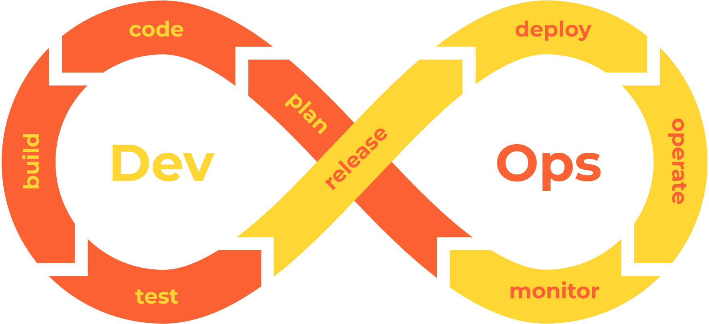

################
7.0 Introduction
################

===================
Learning Objectives
===================

By the end of this chapter, you will be able to:

• Explain how CI/CD pipelines transform software development workflows
• Implement a complete CI/CD pipeline from scratch using GitHub Actions
• Apply security and best practices to production-grade pipelines
• Troubleshoot common pipeline failures and optimize performance
• Design multi-environment deployment strategies
• Integrate monitoring and rollback procedures

**Prerequisites:** Basic understanding of Git, Python programming, and command-line operations.

=========================
What are CI/CD Pipelines?
=========================

CI/CD (Continuous Integration/Continuous Deployment) pipelines are automated workflows that transform your code from development to production. Think of them as an assembly line for software - each station performs a specific task, ensuring your code is built, tested, and deployed reliably.

**Why do we need them?**

- Automate repetitive tasks and eliminate human error
- Catch bugs early when they're 100x cheaper to fix
- Deploy changes safely and quickly to stay competitive
- Enable rapid experimentation and innovation

.. note::

    **Real-world analogy:** Imagine a car manufacturing assembly line. Each station has a specific job (install engine, paint, quality check). Similarly, CI/CD pipelines have stages (build, test, deploy) that your code passes through automatically.

===========================
Continuous Integration (CI)
===========================

**What is CI?**

CI is the practice of frequently merging code changes into a shared repository (like git) - often multiple times per day. Each merge triggers an automated process to build and test the code.

**The Three Pillars of CI:**

#. **Automated Builds**: Your code is automatically compiled into runnable software
#. **Automated Testing**: A comprehensive test suite runs to catch bugs before they reach users
#. **Frequent Integration**: Developers merge code changes regularly (multiple times daily)

**Example Workflow:**

1. Developer writes code locally
2. Commits and pushes to shared repository (Git)
3. CI system automatically detects the change
4. Code is built and all tests run
5. If tests pass, code is ready for the next stage
6. If tests fail, developer is notified immediately
7. Developer fixes issues and repeats the process

.. warning::

    **Avoiding "Integration Hell":** Without CI, developers might work in isolation for weeks, then try to merge everything at once. This often leads to conflicts and bugs that are hard to trace - hence the term "integration hell."

==========================
Continuous Deployment (CD)
==========================

**What is CD?**

CD automatically deploys code that passes all tests directly to production. It's the next step after CI, completing the automation pipeline.

**Two Flavors of CD:**

- **Continuous Deployment**: Automatic deployment to production (e.g., Netflix deploys thousands of times per day)
- **Continuous Delivery**: Automatic deployment to staging, manual approval for production (e.g., banking software with regulatory requirements)

**Key Components:**

#. **Automated Deployment**: No manual intervention needed - like having a robot that can safely install updates
#. **Production-like Testing**: Test in environments that mirror production (same database, same server setup)
#. **Rollback Procedures**: Automatic rollback if issues are detected (like an "undo" button for deployments)
#. **Feature Flags**: Deploy code without activating features, enabling gradual rollouts

.. image:: ../diagrams/pipeline.png
  :alt: A diagram showing schematically how a pipeline works
  :width: 1000 px

.. note::

    **Real-world example:** Think of how your smartphone gets automatic updates. The app developers use CD to push updates that have been thoroughly tested, and if something goes wrong, they can quickly roll back to the previous version.

=========================
Pipeline Stages Explained
=========================

A typical CI/CD pipeline includes the following stages:

**Stage 1: Source Control** 

    *What happens:* The pipeline starts when code is committed to a version control system (e.g., Git)
    
    *Real example:* Developer Sarah fixes a bug in the login system and pushes her code to GitHub

**Stage 2: Build** 

    *What happens:* Code is compiled and dependencies are fetched
    
    *Real example:* The system downloads all required libraries (like React, jQuery) and compiles Sarah's JavaScript into optimized code

**Stage 3: Testing**

    *What happens:* Automated tests verify the code works correctly
    
    *Types of testing:*
    
    - **Unit tests**: Test individual functions (does the login button work?)
    - **Integration tests**: Test how components work together (does login connect to the database?)
    - **Load testing**: Test performance under stress (can 1000 users login simultaneously?)
    - **Security testing**: Check for vulnerabilities (are passwords properly encrypted?)

**Stage 4: Artifact Storage**

    *What happens:* The tested code is packaged and stored securely
    
    *Real example:* Sarah's bug fix is packaged as version 2.1.3 and stored in the company's artifact repository

**Stage 5: Deployment to Staging**

    *What happens:* Code is deployed to a production-like test environment
    
    *Real example:* The new login system is deployed to staging.mycompany.com where QA team can test it

**Stage 6: Approval (Optional)**

    *What happens:* Stakeholders review and approve the changes
    
    *Real example:* Product manager tests the new login flow and approves it for production

**Stage 7: Release to Production**

    *What happens:* Code goes live for end users
    
    *Real example:* Sarah's bug fix is now live on mycompany.com for all customers

**Stage 8: Monitoring**

    *What happens:* System monitors the new code's performance
    
    *Real example:* Monitoring shows login success rate improved from 94% to 99.2%

.. warning::

    **Pipeline Failure Protocol:** If any stage fails (e.g., tests don't pass, security scan finds vulnerabilities), the pipeline stops immediately and alerts the development team. This prevents buggy code from reaching users.

========================================
Popular CI/CD Tools and When to Use Them
========================================

Choosing the right CI/CD tool can make or break your automation strategy. Here's a practical decision guide:

**For Small Teams/Startups or really tech companies:**

- **GitHub Actions**: Perfect if your code is already on GitHub, free for public repos, $4/month for private
- **GitLab CI/CD**: Great all-in-one solution with built-in Git hosting, generous free tier

**For Enterprise on prem**

- **Azure Pipelines** or **Github Enterprise**: Ideal for Microsoft-centric environments, enterprise security features
- **Jenkins**: Highly customizable, self-hosted, thousands of plugins available
- **TeamCity**: JetBrains' solution, excellent for Java/Kotlin projects
- **Gitlab Enterprise**: Advanced features for large teams, integrates with GitLab's ecosystem

**Cloud Platform Integration:**

- **AWS CodePipeline**: Native integration with Amazon Web Services, pay-per-use
- **Google Cloud Build**: Best for Google Cloud Platform projects, strong container support  
- **Azure DevOps**: Seamless integration with Microsoft Azure, enterprise features

**Decision Framework:**

.. code-block:: text

    ┌─ Are you already on GitHub? ──── YES ──── GitHub Actions
    │
    ├─ Need enterprise security? ───── YES ──── Azure DevOps / Jenkins
    │
    ├─ Want everything integrated? ─── YES ──── GitLab CI/CD
    │
    └─ Maximum customization? ──────── YES ──── Jenkins

=================
Benefits of CI/CD
=================

Understanding the benefits helps justify the investment in CI/CD infrastructure:

**Speed & Efficiency**

- **Faster time-to-market**: Features reach customers in days instead of months
- **Reduced deployment time**: From hours of manual work to minutes of automation
- **Example**: Meta deploys code changes 10,000+ times per day vs. traditional monthly releases

**Quality & Reliability**

- **Early bug detection**: Issues caught in development cost 100x less to fix than in production
- **Consistent testing**: Every code change goes through the same rigorous validation
- **Reduced downtime**: Automated rollbacks mean faster recovery from issues

**Team Collaboration**

- **Reduced "works on my machine" problems**: Standardized environments for all developers
- **Better visibility**: Everyone sees the same pipeline status and deployment history
- **Knowledge sharing**: Pipeline configuration serves as documentation

**Cost Reduction**

- **Less manual effort**: Developers focus on features instead of repetitive deployment tasks
- **Fewer production incidents**: Automated testing catches issues before they impact users
- **Resource optimization**: Automated scaling and deployment reduces infrastructure waste

.. tip::

    **ROI Example:** A company spending 20 hours/week on manual deployments can save $50,000+ annually by implementing CI/CD (assuming $50/hour developer cost).

=============================
Common Challenges & Solutions
=============================

**Challenge 1: "Our tests take too long"**

- *Solution*: Implement test parallelization and smart test selection
- *Example*: Run only tests related to changed code for faster feedback

**Challenge 2: "Pipeline keeps breaking"**

- *Solution*: Start simple, add complexity gradually
- *Example*: Begin with basic build + test, then add security scans and performance tests

**Challenge 3: "Team resistance to change"**

- *Solution*: Start with pilot project, demonstrate value with metrics
- *Example*: Show 90% reduction in deployment time and 50% fewer bugs

**Challenge 4: "Legacy systems are hard to automate"**

- *Solution*: Implement CI/CD for new features while gradually modernizing legacy components
- *Example*: Create APIs for legacy systems to enable automated testing

=========================
Getting Started Checklist
=========================

Ready to implement CI/CD? Follow this practical checklist:

**Week 1: Foundation**

- Choose your CI/CD tool based on team needs
- Set up basic pipeline: source → build → test
- Write your first automated test
- Configure notifications for pipeline failures

**Week 2-3: Testing**

- Add unit tests for critical functions
- Implement integration tests
- Set up test environment that mirrors production
- Add code quality checks (linting, security scans)

**Week 4-6: Deployment**

- Create staging environment
- Implement automated deployment to staging
- Add monitoring and logging
- Test rollback procedures

**Week 7-8: Production**

- Deploy first feature using the pipeline
- Monitor performance and gather feedback
- Gradually increase deployment frequency
- Train team on troubleshooting pipeline issues

.. note::

    **Success Metrics to Track:**

    - Deployment frequency (aim for multiple times per day)
    - Lead time (from commit to production)
    - Mean time to recovery (how quickly you fix issues)
    - Change failure rate (percentage of deployments causing problems)

=============
Key Takeaways
=============

CI/CD pipelines are essential for modern software development because they:

1. **Automate the boring stuff** - Let machines handle repetitive tasks while humans focus on creativity
2. **Catch problems early** - Fix bugs when they're cheap and easy to resolve
3. **Enable rapid innovation** - Deploy features quickly and safely to stay competitive
4. **Improve team happiness** - Reduce stress from manual deployments and late-night fixes

Remember: *Perfect is the enemy of good*. Start with a simple pipeline and improve it over time. The goal is progress, not perfection.

.. warning::

    **Common Mistake:** Don't try to implement everything at once. Start small, prove value, then expand. Many teams fail because they over-engineer their first pipeline.

**Next Steps:** In the following sections, we'll dive deeper into specific tools and hands-on implementation examples.
