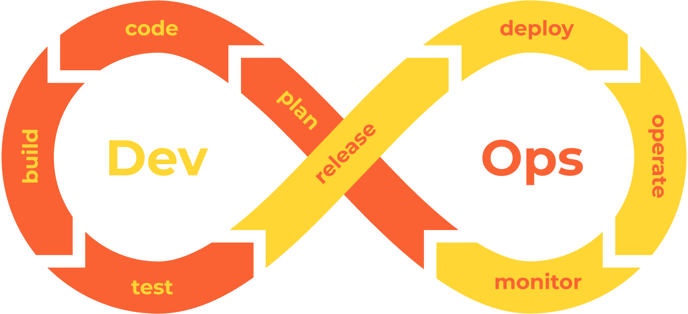
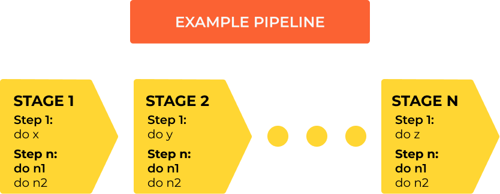

################
7.0 Introduction
################

**Imagine this scenario:** It's Friday afternoon, and your team needs to deploy a critical bug fix. In the old days, this meant hours of manual testing, careful server configuration, and probably staying late to make sure nothing broke. Today, with modern CI/CD pipelines, you can confidently push a commit and watch as automated systems test, validate, and deploy your fix safely to production in minutes.

This transformation from manual, error-prone deployments to automated, reliable pipelines is what we'll explore in this chapter.

===================
Learning Objectives
===================

By the end of this chapter, you will be able to:

• **Understand** how CI/CD pipelines eliminate human error and accelerate development
• **Build** a complete CI/CD pipeline from scratch using modern tools like GitHub Actions
• **Apply** security and reliability best practices that enterprise teams depend on
• **Troubleshoot** common pipeline failures and optimize for speed and cost
• **Design** multi-environment deployment strategies that ensure quality
• **Integrate** monitoring, rollback procedures, and notification systems

**Prerequisites:** Basic understanding of Git, Python programming, and command-line operations.

=========================
What are CI/CD Pipelines?
=========================

**The Assembly Line Revolution**

Think of how Henry Ford revolutionized car manufacturing with the assembly line - instead of one person building an entire car, specialized workers performed specific tasks as the car moved down the line. Each station had a clear job: install the engine, add the wheels, paint the body. This approach was faster, more consistent, and caught problems early.

CI/CD pipelines bring this same revolutionary thinking to software development. Instead of developers manually building, testing, and deploying code, automated "stations" handle each step with precision and consistency.

**The Problem CI/CD Solves:**

Before CI/CD, software teams faced "integration hell" - developers would work in isolation for weeks, then try to merge everything at once. The result? Conflicting changes, broken functionality, and late-night debugging sessions. CI/CD eliminates this by encouraging frequent, small changes that are automatically validated.

.. note::

    **Why This Matters for DevOps:** CI/CD isn't just about automation - it's about enabling teams to respond quickly to business needs while maintaining quality. In today's competitive landscape, the ability to ship features weekly instead of quarterly can determine business success.

===========================
Continuous Integration (CI)
===========================

**The Development Practice That Changed Everything**

Before CI, software development often followed the "big bang" integration model: developers worked on separate features for weeks or months, then tried to combine everything at the end. This approach led to what the industry calls "integration hell" - conflicts were numerous, hard to trace, and expensive to fix.

CI fundamentally changes this by promoting frequent integration of code changes, typically multiple times per day.

**The CI Process Explained:**

1. **Developer writes code** - Luna fixes a login bug on her local machine
2. **Commits and pushes** - Her changes go to the shared Git repository  
3. **Automated trigger** - The CI system detects the new commit immediately
4. **Build process** - Code is compiled and dependencies are resolved
5. **Automated testing** - Comprehensive test suite runs to validate the change
6. **Immediate feedback** - Luna gets notified of success or failure within minutes
7. **Integration or rollback** - Code is either merged or flagged for fixes

**The Three Pillars of Modern CI:**

#. **Automated Builds**: Every commit triggers a fresh build from source code
#. **Comprehensive Testing**: Unit tests, integration tests, and security scans run automatically  
#. **Frequent Integration**: Code changes are merged multiple times daily, not weekly or monthly

**Business Benefits of CI:**

• **Reduced Risk**: Small, frequent changes are easier to test and debug than large releases
• **Faster Feedback**: Developers learn about problems in minutes, not days
• **Higher Quality**: Automated testing catches regressions before they reach users
• **Team Collaboration**: Shared build status keeps everyone informed and aligned

.. warning::

    **Avoiding "Integration Hell":** Without CI, developers might work in isolation for weeks, then try to merge everything at once. This often leads to conflicts and bugs that are hard to trace - hence the term "integration hell."

==========================
Continuous Deployment (CD)
==========================

**From Integration to Production**

While CI focuses on validating code changes, Continuous Deployment (CD) completes the automation story by safely delivering those changes to users. CD represents the ultimate in automation confidence - where code that passes all tests can be automatically deployed to production without human intervention.

**Two Approaches to CD:**

**Continuous Deployment** (Full Automation)
    Every code change that passes all tests is automatically deployed to production. Companies like Netflix, Etsy, and Facebook deploy thousands of times per day using this approach.

    *Best for:* Mature teams with comprehensive testing, strong monitoring, and rapid rollback capabilities.

**Continuous Delivery** (Human Gate)
    Code is automatically prepared for production deployment, but requires human approval for the final step. Banking software, healthcare applications, and other regulated industries often use this approach.

    *Best for:* Industries with compliance requirements or teams building deployment confidence.

**The CD Pipeline Components:**

#. **Automated Testing**: Beyond unit tests, CD requires integration tests, load tests, and security scans
#. **Environment Management**: Staging environments that mirror production configuration
#. **Deployment Automation**: Scripts that can deploy consistently across environments
#. **Monitoring & Alerting**: Real-time detection of issues in production
#. **Rollback Procedures**: Ability to quickly revert to previous versions
#. **Feature Flags**: Deploy code without activating features, enabling gradual rollouts

.. note::

    **The Smartphone Update Analogy:** Think about how your phone receives automatic updates. The app developers use CD to push updates that have been thoroughly tested in environments identical to your phone. If something goes wrong, they can quickly roll back to the previous version. This is exactly how modern web applications deploy changes.

=========================
Pipeline Stages Explained
=========================

Understanding pipeline stages is crucial for designing effective CI/CD workflows. Each stage serves a specific purpose and builds confidence in your code's readiness for production.

**Stage 1: Source Control Trigger** 

    *What happens:* A developer commits code changes to version control (Git), automatically triggering the pipeline

    *Real example:* Luna fixes a critical bug in the user authentication system and pushes her changes to GitHub. The pipeline immediately detects this commit and begins validation.

    *Why it matters:* Every change gets the same level of scrutiny, whether it's a one-line bug fix or a major feature.

**Stage 2: Build & Dependency Resolution** 

    *What happens:* Source code is compiled, dependencies are downloaded, and artifacts are created

    *Real example:* The system downloads required Python packages (like Flask, SQLAlchemy), compiles any native extensions, and creates a distributable package.

    *Duration:* Typically 1-3 minutes for modern Python applications with proper caching

**Stage 3: Multi-Level Testing**

    *What happens:* A comprehensive suite of automated tests validates code functionality, performance, and security

    *Testing pyramid breakdown:*
    
    - **Unit tests** (70%): Test individual functions and classes in isolation
    - **Integration tests** (20%): Verify components work together correctly
    - **End-to-end tests** (10%): Simulate real user workflows
    - **Security scans**: Check for vulnerabilities and compliance issues
    - **Performance tests**: Ensure the application meets speed requirements

    *Real example:* Luna's authentication fix is tested against 500+ unit tests, 50 integration tests, and security scans that check for common vulnerabilities like SQL injection.

**Stage 4: Artifact Storage & Versioning**

    *What happens:* Validated code is packaged and stored with version information for deployment

    *Real example:* Luna's fix becomes version 2.1.3, stored in the artifact repository with full traceability to the original commit, tests run, and deployment history.

**Stage 5: Staging Deployment**

    *What happens:* Code is automatically deployed to a production-like environment for final validation

    *Real example:* The authentication fix goes live on staging.company.com, where it's tested with real data and user workflows.

    *Duration:* Usually 2-5 minutes for containerized applications

**Stage 6: Approval Gate (Optional)**

    *What happens:* Stakeholders review changes before production deployment

    *Real example:* The product manager and security team review the authentication changes and approve them for production deployment.

    *When to use:* Required for regulated industries (finance, healthcare) or critical system changes

**Stage 7: Production Deployment**

    *What happens:* Code goes live for end users, often with gradual rollout strategies

    *Real example:* Luna's fix deploys to 5% of users first, then gradually to 100% as monitoring confirms no issues.

**Stage 8: Post-Deployment Monitoring**

    *What happens:* Automated monitoring tracks system health, user experience, and business metrics

    *Real example:* Monitoring shows login success rate improved from 94% to 99.2%, validating the fix's effectiveness.

    *Key metrics:* Error rates, response times, user satisfaction, business KPIs

.. warning::

    **Pipeline Failure Protocol:** If any stage fails, the pipeline immediately stops and alerts the development team. This "fail-fast" approach prevents problematic code from reaching users and enables quick fixes when issues are small and manageable.

========================================
Popular CI/CD Tools and When to Use Them
========================================

Choosing the right CI/CD platform significantly impacts your team's productivity and operational costs. Here's a practical decision guide based on real-world usage patterns and enterprise requirements.

**For Startups and Small Teams:**

**GitHub Actions**

    *Best when:* Your code already lives on GitHub, team <20 people, budget-conscious
    
    *Strengths:* Deep GitHub integration, generous free tier, extensive marketplace
    
    *Pricing:* Free for public repos, $4/month per private repo
    
    *Reality check:* Used by 73% of organizations on GitHub for CI/CD

**GitLab CI/CD**

    *Best when:* You want an all-in-one DevOps platform, open-source friendly
    
    *Strengths:* Integrated Git hosting, issue tracking, monitoring in one platform
    
    *Pricing:* Free tier includes 400 CI/CD minutes/month, paid plans from $4/user/month

**For Growing Companies (20-200 developers):**

**Azure DevOps**

    *Best when:* Microsoft-centric environment, enterprise security requirements
    
    *Strengths:* Enterprise-grade security, seamless Azure integration, hybrid cloud support
    
    *Considerations:* Higher learning curve, better suited for .NET/Windows stacks

**AWS CodePipeline**

    *Best when:* Heavily invested in AWS ecosystem, need native integration
    
    *Strengths:* Native AWS service integration, pay-per-use pricing, scales automatically
    
    *Trade-offs:* Vendor lock-in, can be complex for simple use cases

**For Enterprise and Complex Environments:**

**Jenkins**

    *Best when:* Maximum customization needed, complex build requirements, hybrid environments
    
    *Strengths:* 1,800+ plugins, complete control, self-hosted flexibility
    
    *Reality check:* Requires dedicated operations team, higher maintenance overhead

**CircleCI**

    *Best when:* Docker-first workflows, need advanced caching, performance-critical pipelines
    
    *Strengths:* Excellent performance, sophisticated caching, strong Docker support
    
    *Enterprise features:* Advanced analytics, compliance reports, dedicated support

**Decision Framework for 2024:**

.. code-block:: text

    ┌─ Already using GitHub? ────────────────── YES ──── GitHub Actions
    │
    ├─ Need everything integrated? ──────────── YES ──── GitLab CI/CD  
    │
    ├─ Microsoft/Azure ecosystem? ──────────── YES ──── Azure DevOps
    │
    ├─ AWS-native applications? ──────────────── YES ──── AWS CodePipeline
    │
    ├─ Maximum control/customization? ────────── YES ──── Jenkins
    │
    └─ Performance-critical workflows? ───────── YES ──── CircleCI

**Platform Adoption Trends (2024 Data):**

- GitHub Actions: 73% of GitHub users, fastest-growing platform
- Jenkins: Still dominates enterprise (40% market share) but declining in new projects
- GitLab CI/CD: Strong in open-source and medium enterprises
- Azure DevOps: Growing in Microsoft-centric organizations
- CircleCI: Preferred for performance-sensitive applications

.. tip::

    **Migration Strategy:** Most successful teams start with their Git provider's native CI/CD (GitHub Actions, GitLab CI/CD) and only migrate to specialized platforms when they hit specific limitations. This approach minimizes initial complexity while keeping migration paths open.

=================
Benefits of CI/CD
=================

Understanding the concrete benefits helps justify the investment in CI/CD infrastructure and drives adoption across your organization.

-----------------------------
Speed & Market Responsiveness
-----------------------------

*Metric:* Teams with mature CI/CD deploy 200x more frequently than traditional teams

• **Faster time-to-market**: Features reach customers in days instead of months
• **Reduced deployment time**: From hours of manual work to minutes of automation  
• **Competitive advantage**: Respond to market changes and user feedback rapidly

*Real example:* Meta (Facebook) deploys code changes 10,000+ times per day, enabling them to A/B test features and respond to user behavior in real-time.

----------------------------------
Quality & Reliability Improvements
----------------------------------

*Metric:* Organizations with strong CI/CD practices have 50% fewer deployment failures

• **Early bug detection**: Issues caught in development cost 100x less to fix than in production
• **Consistent testing**: Every code change goes through identical validation processes
• **Reduced downtime**: Automated rollbacks and monitoring minimize service interruptions
• **Regression prevention**: Comprehensive test suites catch breaking changes before they reach users

*Real example:* Netflix's chaos engineering and automated testing practices enable 99.99% uptime despite thousands of daily deployments.

--------------------------------
Team Productivity & Satisfaction
--------------------------------

*Metric:* Developers save 2-4 hours per week on deployment-related tasks with mature CI/CD

• **Eliminated "works on my machine" problems**: Standardized environments for all developers
• **Better team visibility**: Everyone sees pipeline status, deployment history, and code quality metrics
• **Focus on value creation**: Developers spend time building features instead of managing deployments
• **Reduced stress**: No more late-night deployment sessions or emergency fixes

--------------------------------------
Cost Reduction & Resource Optimization
--------------------------------------

*ROI calculation:* A 10-person development team typically saves $150,000+ annually with mature CI/CD

• **Reduced manual effort**: Automation eliminates repetitive tasks
• **Fewer production incidents**: Proactive testing prevents costly outages
• **Resource optimization**: Automated scaling and deployment reduces infrastructure waste
• **Faster onboarding**: New team members can contribute productively from day one

.. tip::

    **Measuring CI/CD Success:** Track these key metrics to demonstrate value:
    
    - **Deployment frequency**: How often you ship (aim for daily)
    - **Lead time**: Commit to production time (aim for <1 hour)
    - **Mean time to recovery**: How quickly you fix issues (aim for <1 hour)
    - **Change failure rate**: Percentage of deployments causing problems (aim for <5%)

---------------------------------
Industry Transformation Examples:
---------------------------------

• **Capital One**: Reduced deployment time from months to minutes, enabling 50+ deployments per day
• **Etsy**: Went from monthly releases to 25+ daily deployments while reducing deployment-related outages by 90%
• **ING Bank**: Transformed from waterfall to continuous delivery, reducing time-to-market by 60%

.. note::

    **Cultural Transformation:** The biggest CI/CD benefit isn't technical - it's cultural. Teams shift from "deployment day anxiety" to "deployment confidence," enabling innovation and experimentation that drives business growth.

=============================
Common Challenges & Solutions
=============================

Every organization faces predictable challenges when implementing CI/CD. Here are the most common obstacles and proven solutions.

--------------------------------------------
Challenge 1: "Our tests take forever to run"
--------------------------------------------

*Symptoms:* Developers avoid running full test suites, pipeline feedback takes 30+ minutes

*Root causes:* Poorly designed tests, lack of parallelization, inefficient test environments

*Solutions that work:*

- **Test parallelization**: Run tests across multiple machines simultaneously
- **Smart test selection**: Only run tests affected by code changes
- **Optimize slow tests**: Profile and improve the slowest 20% of tests first
- **Use test pyramids**: More unit tests (fast), fewer integration tests (slow)

*Example implementation:* Spotify reduced test runtime from 45 minutes to 8 minutes by implementing parallel testing and smart test selection.

---------------------------------------------------
Challenge 2: "Our pipeline keeps breaking randomly"
---------------------------------------------------

*Symptoms:* Flaky tests, intermittent failures, environment inconsistencies

*Root causes:* Test dependencies, timing issues, environment configuration drift

*Solutions that work:*

- **Containerize everything**: Use Docker to ensure consistent environments
- **Eliminate test dependencies**: Each test should be independent and isolated
- **Fix flaky tests immediately**: Treat them as P1 bugs that undermine confidence
- **Use infrastructure as code**: Version control your pipeline configuration

*Example:* Netflix's approach to flaky tests is zero tolerance - any test that fails intermittently is either fixed immediately or disabled until it can be fixed.

------------------------------------------------
Challenge 3: "The team resists the new workflow"
------------------------------------------------

*Symptoms:* Developers bypass the pipeline, complaints about "process overhead"

*Root causes:* Lack of training, unclear benefits, poor user experience

*Solutions that work:*

- **Start with volunteers**: Begin with a pilot team that champions the change
- **Make it faster than the old way**: Ensure CI/CD is genuinely more efficient
- **Provide training and support**: Invest in team education and documentation
- **Show concrete metrics**: Demonstrate reduced bugs, faster deployments, fewer late nights

*Change management tip:* Focus on developer experience first. If the pipeline makes developers' lives easier, adoption follows naturally.

------------------------------------------------
Challenge 4: "Legacy systems can't be automated"
------------------------------------------------

*Symptoms:* Manual testing requirements, complex deployment procedures, undocumented systems

*Root causes:* Technical debt, lack of documentation, monolithic architecture

*Solutions that work:*

- **Gradual modernization**: Implement CI/CD for new features while slowly refactoring legacy code
- **API-fy legacy systems**: Create APIs that enable automated testing
- **Document as you go**: Use pipeline implementation as an opportunity to document systems
- **Strangler fig pattern**: Gradually replace legacy components with modern, testable alternatives

*Reality check:* Most successful transformations take 12-18 months. Focus on progress, not perfection.

---------------------------------------------------
Challenge 5: "Security and compliance slow us down"
---------------------------------------------------

*Symptoms:* Manual security reviews, long approval processes, audit requirements

*Root causes:* Traditional security practices not adapted for DevOps

*Solutions that work:*

- **Shift security left**: Build security checks into the pipeline
- **Automate compliance**: Use tools like policy-as-code for consistent enforcement
- **Continuous monitoring**: Replace periodic audits with real-time security monitoring
- **DevSecOps culture**: Make security everyone's responsibility, not just the security team's

*Example:* Capital One automated 80% of their security compliance checks, reducing approval time from weeks to hours while improving security posture.

=========================
Getting Started Checklist
=========================

Ready to implement CI/CD? This practical roadmap is based on successful implementations across hundreds of organizations.

**Phase 1: Foundation (Week 1-2)**

*Goal:* Get a basic pipeline running and build team confidence

- [ ] **Choose your platform** based on team needs and existing tools
- [ ] **Set up basic pipeline**: source → build → test (start simple!)
- [ ] **Write your first automated test** (even a simple smoke test counts)
- [ ] **Configure notifications** for pipeline failures (Slack, email, etc.)
- [ ] **Document the workflow** so teammates can understand and contribute

*Success criteria:* Every commit triggers an automated build and test run

**Phase 2: Quality Gates (Week 3-4)**

*Goal:* Implement comprehensive testing and quality checks

- [ ] **Add unit tests** for critical business logic (aim for 70%+ coverage)
- [ ] **Implement integration tests** for key user workflows
- [ ] **Set up code quality checks** (linting, formatting, security scans)
- [ ] **Create staging environment** that mirrors production configuration
- [ ] **Establish quality gates** (tests must pass before merge)

*Success criteria:* No code reaches production without passing all quality checks

**Phase 3: Deployment Automation (Week 5-8)**

*Goal:* Automate deployment to remove manual bottlenecks

- [ ] **Implement automated deployment** to staging environment
- [ ] **Add monitoring and logging** to track application health
- [ ] **Test rollback procedures** (practice failing gracefully)
- [ ] **Set up environment promotion** (staging → production workflow)
- [ ] **Configure deployment notifications** and status dashboards

*Success criteria:* Code can be deployed to any environment with a single click

**Phase 4: Production Readiness (Week 9-12)**

*Goal:* Deploy confidently to production with full observability

- [ ] **Deploy first feature** using the complete pipeline
- [ ] **Implement monitoring** for business metrics and system health
- [ ] **Set up alerting** for critical issues and anomalies
- [ ] **Gather team feedback** and iterate on the process
- [ ] **Train team** on troubleshooting and incident response

*Success criteria:* Regular production deployments with minimal manual intervention

**Success Metrics to Track:**

*Lead Time:* Time from commit to production deployment

- Week 1: Establish baseline (often 2-4 weeks manually)
- Week 4: Target <1 day for simple changes
- Week 8: Target <4 hours for most changes
- Week 12: Target <1 hour for simple fixes

*Deployment Frequency:* How often you ship to production

- Week 1: Baseline (often monthly or quarterly)
- Week 4: Weekly deployments
- Week 8: Daily deployments for urgent fixes
- Week 12: Multiple deployments per day

*Change Failure Rate:* Percentage of deployments requiring rollback

- Week 1: Establish baseline (often 20-40%)
- Week 4: Target <15%
- Week 8: Target <10%
- Week 12: Target <5%

*Recovery Time:* How quickly you fix production issues

- Week 1: Establish baseline (often hours or days)
- Week 4: Target <4 hours
- Week 8: Target <1 hour
- Week 12: Target <15 minutes for rollbacks

.. note::

    **Realistic Expectations:** Most organizations take 3-6 months to achieve mature CI/CD practices. Focus on continuous improvement rather than perfection. Each phase builds confidence and capabilities for the next level.

=============
Key Takeaways
=============

CI/CD represents a fundamental shift in how we build and deploy software. The practices you'll learn in this chapter aren't just technical improvements - they're business enablers that allow organizations to compete effectively in today's fast-moving digital landscape.

**Core Principles to Remember:**

1. **Start simple, improve continuously** - A basic pipeline that works is infinitely better than a complex pipeline that doesn't exist
2. **Automate the painful parts first** - Focus on the manual tasks that cause the most frustration and errors
3. **Build quality in from the start** - It's easier to prevent bugs than to find and fix them later
4. **Make feedback fast and actionable** - Developers should know within minutes if their changes are working
5. **Treat your pipeline as critical infrastructure** - Invest in its reliability, performance, and maintainability

**Business Impact:**

Organizations that master CI/CD consistently outperform their competitors in:

- Time-to-market for new features
- System reliability and uptime  
- Developer productivity and satisfaction
- Ability to respond to customer feedback

**What Comes Next:**

In the following sections, we'll move from theory to practice. You'll build real pipelines, encounter actual problems, and learn to solve them using the same tools and techniques that power the world's most successful technology companies.

**Ready to Begin?**

The journey from manual deployments to automated excellence starts with a single commit. Let's build your first pipeline together.

.. warning::

    **Avoid This Common Mistake:** Many teams try to implement "perfect" CI/CD from day one. This leads to analysis paralysis and months of planning without results. Instead, start with the simplest possible pipeline and improve it based on real experience. Your first pipeline won't be perfect, and that's exactly right.
