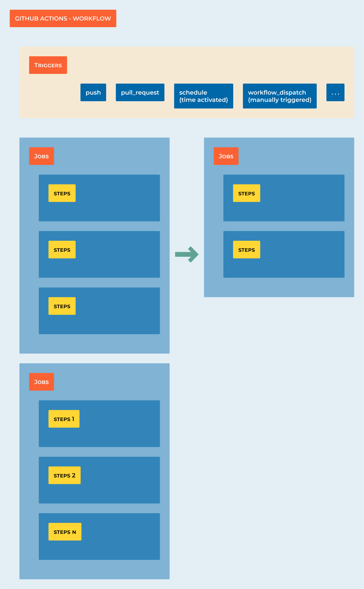

###################
7.1 Getting started
###################

===================
Learning Objectives
===================

By the end of this section, you will:

• Create your first GitHub Actions workflow in under 10 minutes
• Understand YAML syntax and workflow structure
• Configure different trigger events for your pipelines
• Troubleshoot common first-time setup issues
• Build and test a Python project automatically

**Prerequisites:** GitHub account, basic Git knowledge, text editor

=================================
Your First Pipeline in 10 Minutes
=================================

Let's get you from zero to working CI/CD pipeline in record time!

**Step 1: Quick Repository Setup (2 minutes)**

1. Create a new repository on GitHub called `my-first-pipeline`
2. Clone it locally: `git clone https://github.com/yourusername/my-first-pipeline.git`
3. Create a simple Python file:

.. code-block:: python

    # hello.py
    def greet(name):
        return f"Hello, {name}!"
    
    if __name__ == "__main__":
        print(greet("CI/CD World"))

**Step 2: Create the Workflow (3 minutes)**

1. Create directories: `mkdir -p .github/workflows`
2. Create workflow file: `.github/workflows/ci.yml`

.. code-block:: yaml

    name: Quick Start CI
    on:
      push:
        branches: [ main ]
      pull_request:
        branches: [ main ]
    
    jobs:
      test:
        runs-on: ubuntu-latest
        steps:
          - name: Get the code
            uses: actions/checkout@v4
          
          - name: Set up Python
            uses: actions/setup-python@v5
            with:
              python-version: '3.12'
          
          - name: Run our script
            run: python hello.py

**Step 3: Push and Watch (2 minutes)**

.. code-block:: bash

    git add .
    git commit -m "Add first CI pipeline"
    git push origin main

**Step 4: View Results (1 minute)**

1. Go to your GitHub repository
2. Click the "Actions" tab
3. Watch your first pipeline run!

**Step 5: Celebrate! (2 minutes)**

You just created your first CI/CD pipeline! 

.. tip::

    **What Just Happened?**

    - GitHub detected your workflow file
    - Spun up a virtual machine (runner)
    - Installed Python 3.12
    - Ran your script
    - Reported success/failure

=====================================
Troubleshooting: When Things Go Wrong
=====================================

**Problem 1: "Workflow not running"**

*Symptoms:* No workflow appears in Actions tab after pushing

*Solutions:*

- Check file path: Must be `.github/workflows/filename.yml`
- Verify YAML syntax: Use a YAML validator online
- Check branch triggers: Make sure you're pushing to the right branch
- File extension: Must be `.yml` or `.yaml`

.. code-block:: bash

    # Debug command to check file structure
    find . -name "*.yml" -o -name "*.yaml"
    
    # Should show: ./.github/workflows/ci.yml

**Problem 2: "YAML syntax error"**

*Symptoms:* Workflow shows up but immediately fails with syntax error

*Solutions:*

- **Indentation matters!** Use 2 spaces, not tabs
- **Quotes matter!** Use quotes around special characters
- **Colons matter!** Every key needs a colon and space

.. code-block:: yaml

    # WRONG - inconsistent indentation
    jobs:
    test:
        runs-on: ubuntu-latest
    
    # CORRECT - consistent 2-space indentation  
    jobs:
      test:
        runs-on: ubuntu-latest

**Problem 3: "Action not found"**

*Symptoms:* Error like "Can't find action actions/checkout@v5"

*Solutions:*

- Use exact version numbers: `@v4` not `@v5` (if v5 doesn't exist)
- Check the GitHub Marketplace for correct action names
- Verify internet connectivity on runners

**Problem 4: "Python script fails"**

*Symptoms:* Python runs but your script has errors

*Solutions:*

- Test your script locally first: `python hello.py`
- Check file paths - runner starts in repository root
- Add debugging output to see what's happening

.. code-block:: yaml

    - name: Debug environment
      run: |
        pwd
        ls -la
        python --version
        which python

**Problem 5: "Runner out of space"**

*Symptoms:* Error about disk space or memory

*Solutions:*

- Clean up before running: `sudo apt-get clean`
- Use smaller base images
- Remove unnecessary files

.. code-block:: yaml

    - name: Free up space
      run: |
        sudo apt-get clean
        sudo rm -rf /usr/share/dotnet
        sudo rm -rf /opt/ghc

**Quick Debugging Checklist:**

1. Is the file in `.github/workflows/`?
2. Is the YAML indentation correct (2 spaces)?
3. Are all strings properly quoted?
4. Does the script work locally?
5. Are you pushing to the correct branch?

.. warning::

    **Most Common Beginner Mistake:** Mixing tabs and spaces in YAML. Set your editor to show whitespace and use only spaces!

================================
Understanding Workflow Structure
================================

Now that you have a working pipeline, let's understand what each part does:

**Workflow Anatomy:**

.. code-block:: yaml

    name: Quick Start CI                    # 1. Workflow name (appears in Actions tab)
    on:                                     # 2. Trigger events
      push:
        branches: [ main ]
      pull_request:
        branches: [ main ]
    
    jobs:                                   # 3. Jobs run in parallel
      test:                                 # 4. Job name
        runs-on: ubuntu-latest              # 5. Virtual machine type
        steps:                              # 6. Sequential steps
          - name: Get the code              # 7. Step name (optional)
            uses: actions/checkout@v4       # 8. Pre-built action
          
          - name: Set up Python            # 9. Another step
            uses: actions/setup-python@v5   # 10. Action with parameters
            with:
              python-version: '3.12'
          
          - name: Run our script           # 11. Custom command
            run: python hello.py

**Key Concepts:**

• **Workflow**: The entire automation process (this YAML file)
• **Job**: A group of steps that run on the same runner
• **Step**: Individual task (run a command, use an action)
• **Action**: Reusable code (like installing Python)
• **Runner**: Virtual machine that executes your workflow

===============================
Understanding Workflow Triggers
===============================

The ``on`` keyword defines when your workflow runs. Choose triggers based on your team's workflow:

**Basic Triggers:**

.. code-block:: yaml

    # Trigger on any push
    on: push
    
    # Trigger on specific branches only
    on:
      push:
        branches: [ main, develop ]
        paths: [ 'src/**', 'tests/**' ]  # Only when these files change
    
    # Trigger on pull requests
    on:
      pull_request:
        branches: [ main ]

**Advanced Triggers:**

.. code-block:: yaml

    # Multiple triggers
    on:
      push:
        branches: [ main ]
      pull_request:
        branches: [ main ]
      schedule:
        - cron: '0 2 * * *'        # Daily at 2 AM
      workflow_dispatch:           # Manual trigger button
        inputs:
          environment:
            description: 'Environment to deploy to'
            required: true
            default: 'staging'
            type: choice
            options:
              - staging
              - production

**Real-World Trigger Strategies:**

• **Feature branches**: Run tests on every push to any branch
• **Main branch**: Run tests + deploy to staging
• **Release tags**: Deploy to production
• **Scheduled**: Run security scans nightly
• **Manual**: Emergency deployments or one-off tasks

.. tip::

    **Best Practice**: Start with simple triggers (`push`, `pull_request`) and add complexity as your team grows comfortable with CI/CD.

=========================================
Example: Complete Python Project Pipeline
=========================================

Let's build a production-ready workflow for a Python web application:

.. code-block:: yaml

    name: Production-Ready Python CI
    on:
      push:
        branches: [ main, develop ]
      pull_request:
        branches: [ main ]
    
    jobs:
      test:
        runs-on: ubuntu-latest
        strategy:
          matrix:
            python-version: ["3.10", "3.11", "3.12"]
        
        steps:
          - name: Checkout code
            uses: actions/checkout@v4
          
          - name: Install uv
            uses: astral-sh/setup-uv@v3
          
          - name: Set up Python ${{ matrix.python-version }}
            run: uv python install ${{ matrix.python-version }}
          
          - name: Install dependencies
            run: uv sync --dev
          
          - name: Code quality checks
            run: |
              uv run ruff check .           # Fast linting
              uv run ruff format --check .  # Format checking
              uv run mypy src/             # Type checking
          
          - name: Security scan
            run: uv run bandit -r src/
          
          - name: Run tests with coverage
            run: |
              uv run pytest --cov=src --cov-report=xml --cov-report=term-missing
          
          - name: Upload coverage reports
            uses: codecov/codecov-action@v4
            with:
              file: ./coverage.xml
              fail_ci_if_error: true

**Why This Pipeline Works Well:**

• **Matrix strategy**: Tests across Python 3.10, 3.11, and 3.12
• **Modern tools**: uv for speed, ruff for linting, mypy for types
• **Security**: bandit scans for common vulnerabilities
• **Coverage**: Tracks test coverage and uploads to Codecov
• **Fast feedback**: Parallel jobs complete in ~3 minutes

========================
Common Workflow Patterns
========================

**Pattern 1: Fail Fast**

Put quick checks first to give developers fast feedback:

.. code-block:: yaml

    jobs:
      quick-checks:
        runs-on: ubuntu-latest
        steps:
          - uses: actions/checkout@v4
          - name: Install uv
            uses: astral-sh/setup-uv@v3
          - run: uv run ruff check .        # Fast linting first
          - run: uv run ruff format --check . # Format check second
      
      thorough-tests:
        needs: quick-checks                 # Only run if quick checks pass
        runs-on: ubuntu-latest
        steps:
          # ... full test suite

**Pattern 2: Conditional Jobs**

Run expensive jobs only when needed:

.. code-block:: yaml

    jobs:
      test:
        runs-on: ubuntu-latest
        # ... test steps
      
      deploy:
        needs: test
        if: github.ref == 'refs/heads/main'  # Only deploy from main branch
        runs-on: ubuntu-latest
        steps:
          # ... deployment steps

**Pattern 3: Artifact Sharing**

Share build artifacts between jobs:

.. code-block:: yaml

    jobs:
      build:
        runs-on: ubuntu-latest
        steps:
          - uses: actions/checkout@v4
          - name: Build package
            run: uv build
          - name: Upload artifacts
            uses: actions/upload-artifact@v4
            with:
              name: dist
              path: dist/
      
      test:
        needs: build
        runs-on: ubuntu-latest
        steps:
          - name: Download artifacts
            uses: actions/download-artifact@v4
            with:
              name: dist
              path: dist/

===================
Progress Checkpoint
===================

**By now you should be able to:**

• Create GitHub Actions workflows from scratch
• Choose appropriate triggers for your use case
• Troubleshoot common YAML and workflow issues
• Build multi-job pipelines with dependencies
• Use modern Python tooling in CI/CD

**Next Steps:**

In the following sections, we'll dive deeper into:

- Building more complex Python applications with databases
- Advanced GitHub Actions features and optimizations
- Security scanning and best practices
- Multi-environment deployments

.. note::

    Practice Opportunity: Try modifying the Python pipeline above to include additional tools like pre-commit, bandit or safety (dependency vulnerability scanning) on python-version: [3.11, 3.12, 3.13]

.. code-block:: bash        
        
    steps:
      - name: Checkout code
        uses: actions/checkout@v4
      
      - name: Set up Python ${{ matrix.python-version }}
        uses: actions/setup-python@v4
        with:
          python-version: ${{ matrix.python-version }}
      
      - name: Install dependencies
        run: |
          python -m pip install --upgrade pip
          pip install flake8 pytest
          if [ -f requirements.txt ]; then pip install -r requirements.txt; fi
      
      - name: Lint with flake8
        run: |
          # Stop the build if there are Python syntax errors or undefined names
          flake8 . --count --select=E9,F63,F7,F82 --show-source --statistics
          # Exit-zero treats all errors as warnings
          flake8 . --count --exit-zero --max-complexity=10 --max-line-length=127 --statistics
      
      - name: Test with pytest
        run: |
          pytest

.. note::

    **Matrix builds:** The ``strategy.matrix`` allows you to test against multiple Python versions simultaneously, ensuring your code works across different environments.

====================================
Example 3: Modern Python CI Pipeline
====================================

Here's a comprehensive CI pipeline using modern Python tools like ``uv``, ``ruff``, and ``bandit``:

.. code-block:: yaml

    name: Python CI with Modern Tools
    on:
      push:
        branches: [ main, develop ]
      pull_request:
        branches: [ main ]
    
    jobs:
      ci:
        runs-on: ubuntu-latest
        strategy:
          matrix:
            python-version: ["3.10", "3.11", "3.12"]
        
        steps:
          - name: Checkout code
            uses: actions/checkout@v4
          
          - name: Set up Python ${{ matrix.python-version }}
            uses: actions/setup-python@v4
            with:
              python-version: ${{ matrix.python-version }}
          
          - name: Install uv
            uses: astral-sh/setup-uv@v3
            with:
              enable-cache: true
              cache-dependency-glob: "uv.lock"
          
          - name: Install dependencies
            run: |
              uv sync --dev
          
          - name: Code formatting check with ruff
            run: |
              uv run ruff format --check .
          
          - name: Linting with ruff
            run: |
              uv run ruff check .
          
          - name: Type checking with mypy
            run: |
              uv run mypy src/
          
          - name: Security scan with bandit
            run: |
              uv run bandit -r src/ -f json -o bandit-report.json
              uv run bandit -r src/
          
          - name: Run tests with pytest
            run: |
              uv run pytest --cov=src --cov-report=xml --cov-report=term-missing
          
          - name: Upload coverage to Codecov
            uses: codecov/codecov-action@v3
            with:
              file: ./coverage.xml
              fail_ci_if_error: true
          
          - name: Upload security report
            uses: actions/upload-artifact@v4
            if: always()
            with:
              name: security-report-${{ matrix.python-version }}
              path: bandit-report.json

.. tip::

    **Modern Python Tools Explained:**
    
    - ``uv``: Ultra-fast Python package installer and resolver
    - ``ruff``: Lightning-fast Python linter and formatter (replaces flake8, black, isort)
    - ``bandit``: Security vulnerability scanner for Python
    - ``mypy``: Static type checker
    - ``pytest``: Testing framework with coverage reporting

=============================================
Example 4: Python CD Pipeline with Deployment
=============================================

This workflow shows continuous deployment for a Python application:

.. code-block:: yaml

    name: Python CD Pipeline
    on:
      push:
        branches: [ main ]
        tags: [ 'v*' ]
    
    jobs:
      # First run CI to ensure quality
      test:
        uses: ./.github/workflows/ci.yml  # Reference the CI workflow
      
      # Build and package the application
      build:
        needs: test
        runs-on: ubuntu-latest
        steps:
          - name: Checkout code
            uses: actions/checkout@v4
          
          - name: Set up Python
            uses: actions/setup-python@v4
            with:
              python-version: "3.11"
          
          - name: Install uv
            uses: astral-sh/setup-uv@v3
          
          - name: Build package
            run: |
              uv build
          
          - name: Upload build artifacts
            uses: actions/upload-artifact@v4
            with:
              name: python-package
              path: dist/
      
      # Deploy to staging environment
      deploy-staging:
        needs: build
        runs-on: ubuntu-latest
        environment: staging
        steps:
          - name: Download artifacts
            uses: actions/download-artifact@v4
            with:
              name: python-package
              path: dist/
          
          - name: Deploy to staging
            run: |
              echo "Deploying to staging environment..."
              # Example deployment commands:
              # pip install dist/*.whl
              # systemctl restart myapp
              # Or deploy to cloud platform
          
          - name: Run smoke tests
            run: |
              echo "Running smoke tests on staging..."
              # curl -f http://staging.myapp.com/health
              # python -m pytest tests/smoke/
      
      # Deploy to production (only on tags)
      deploy-production:
        needs: deploy-staging
        runs-on: ubuntu-latest
        environment: production
        if: startsWith(github.ref, 'refs/tags/v')
        steps:
          - name: Download artifacts
            uses: actions/download-artifact@v4
            with:
              name: python-package
              path: dist/
          
          - name: Deploy to production
            run: |
              echo "Deploying version ${{ github.ref_name }} to production..."
              # Production deployment commands
          
          - name: Create GitHub release
            uses: softprops/action-gh-release@v1
            with:
              files: dist/*
              generate_release_notes: true

============================================
Example 5: Complete Python Project Structure
============================================

For these workflows to work, your Python project should have this structure:

.. code-block:: text

    my-python-project/
    ├── .github/
    │   └── workflows/
    │       ├── ci.yml
    │       └── cd.yml
    ├── src/
    │   └── myapp/
    │       ├── __init__.py
    │       └── main.py
    ├── tests/
    │   ├── __init__.py
    │   ├── test_main.py
    │   └── smoke/
    │       └── test_health.py
    ├── pyproject.toml
    ├── uv.lock
    └── README.md

**Sample pyproject.toml:**

.. code-block:: toml

    [build-system]
    requires = ["hatchling"]
    build-backend = "hatchling.build"
    
    [project]
    name = "myapp"
    version = "0.1.0"
    description = "My awesome Python app"
    dependencies = [
        "fastapi>=0.100.0",
        "uvicorn>=0.20.0",
    ]
    
    [project.optional-dependencies]
    dev = [
        "pytest>=7.0.0",
        "pytest-cov>=4.0.0",
        "ruff>=0.1.0",
        "mypy>=1.5.0",
        "bandit>=1.7.0",
    ]
    
    [tool.ruff]
    target-version = "py310"
    line-length = 88
    
    [tool.ruff.lint]
    select = ["E", "F", "I", "N", "W", "UP"]
    
    [tool.mypy]
    python_version = "3.10"
    strict = true
    
    [tool.pytest.ini_options]
    testpaths = ["tests"]
    addopts = "--strict-markers --strict-config"

=========================
Sample Python Application
=========================

**src/myapp/main.py:**

.. code-block:: python

    """A simple FastAPI application."""
    from fastapi import FastAPI
    
    app = FastAPI(title="My App", version="0.1.0")
    
    @app.get("/")
    def read_root() -> dict[str, str]:
        """Return a welcome message."""
        return {"message": "Hello, World!"}
    
    @app.get("/health")
    def health_check() -> dict[str, str]:
        """Health check endpoint."""
        return {"status": "healthy"}
    
    if __name__ == "__main__":
        import uvicorn
        uvicorn.run(app, host="0.0.0.0", port=8000)

**tests/test_main.py:**

.. code-block:: python

    """Tests for the main application."""
    from fastapi.testclient import TestClient
    from myapp.main import app
    
    client = TestClient(app)
    
    def test_read_root():
        """Test the root endpoint."""
        response = client.get("/")
        assert response.status_code == 200
        assert response.json() == {"message": "Hello, World!"}
    
    def test_health_check():
        """Test the health check endpoint."""
        response = client.get("/health")
        assert response.status_code == 200
        assert response.json() == {"status": "healthy"}

===============================
Best Practices for Python CI/CD
===============================

1. **Use modern tools**: ``uv`` for dependency management, ``ruff`` for linting/formatting
2. **Pin versions**: Lock your dependencies with ``uv.lock``
3. **Multi-environment testing**: Test against multiple Python versions
4. **Security scanning**: Include ``bandit`` and dependency vulnerability checks
5. **Coverage tracking**: Aim for >90% test coverage
6. **Type safety**: Use ``mypy`` for static type checking
7. **Environment separation**: Use GitHub environments for staging/production

.. tip::
    **Quick Setup Commands:**
    
    .. code-block:: bash
    
        # Initialize a new Python project with uv
        uv init myapp
        cd myapp
        
        # Add development dependencies
        uv add --dev pytest pytest-cov ruff mypy bandit
        
        # Create basic CI workflow
        mkdir -p .github/workflows
        # Copy the CI example above to .github/workflows/ci.yml
