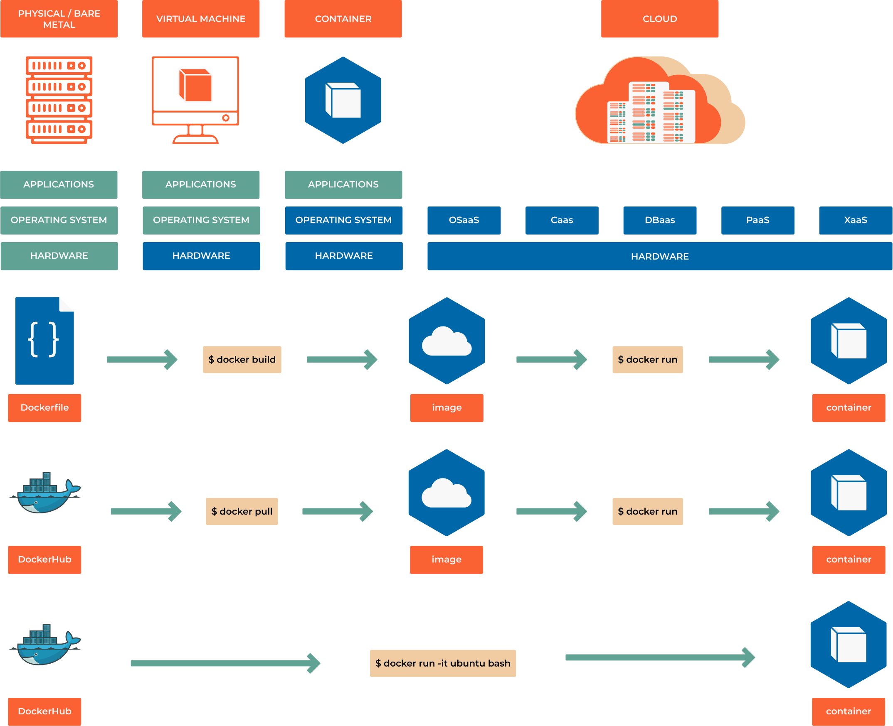

################
8.0 Introduction
################

**Imagine this scenario:** Your team has built a Python web application that works perfectly on your laptop. But when you try to deploy it to the staging server, you get cryptic dependency errors. The production server runs a different Python version. Your colleague can't even get it running locally because they're missing a system library. Sound familiar?

This is the classic "it works on my machine" problem that has plagued software teams for decades. Containers solve this fundamental challenge by packaging your application with everything it needs to run, creating a consistent experience from development to production.

===================
Learning Objectives
===================

By the end of this chapter, you will be able to:

• **Understand** how containers revolutionize application deployment and eliminate environment inconsistencies
• **Build** containerized applications using Docker and modern alternatives like Podman
• **Create** production-ready Dockerfiles following security and performance best practices
• **Orchestrate** multi-container applications using Docker Compose
• **Implement** container security scanning and vulnerability management
• **Deploy** containerized applications to production environments with confidence

**Prerequisites:** Basic understanding of command-line operations, software dependencies, and application deployment concepts.

==================================
The Container Revolution Explained
==================================

**From Shipping to Software**

The concept of containers isn't new - the shipping industry revolutionized global trade in the 1950s by standardizing cargo containers. Before containers, loading a ship was a manual, time-consuming process with different packaging for every type of cargo. With standardized containers, any cargo could be efficiently loaded onto any ship, truck, or train.

Software containers bring this same standardization to application deployment. Instead of worrying about different operating systems, library versions, or system configurations, you package your application in a standardized container that runs identically everywhere.

**The Problem Containers Solve:**

Traditional application deployment faces several critical challenges:

- **Environment drift:** Development, staging, and production environments gradually diverge
- **Dependency conflicts:** Different applications require conflicting versions of the same library
- **Resource waste:** Virtual machines consume significant overhead for simple applications
- **Scaling complexity:** Adding new servers requires manual configuration and setup

.. note::

    **Why This Matters for DevOps:** Containers are foundational to modern DevOps practices. They enable infrastructure as code, simplify CI/CD pipelines, and make microservices architectures practical. Understanding containers isn't optional - it's essential for modern software delivery.

==============================
Containers vs Virtual Machines
==============================

Understanding the difference between containers and virtual machines is crucial for grasping why containers have become the standard for modern application deployment:

**Virtual Machines:**

- Include a complete operating system
- Require significant CPU and memory overhead
- Boot slowly (minutes)
- Provide strong isolation through hardware virtualization
- Ideal for running different operating systems or legacy applications

**Containers:**

- Share the host operating system kernel
- Minimal overhead (megabytes vs gigabytes)
- Start instantly (milliseconds)
- Provide process-level isolation
- Perfect for microservices and cloud-native applications

**Real-world impact:** A single server that might run 5-10 virtual machines can easily run 50-100 containers, dramatically improving resource utilization and cost efficiency.

====================
What is a Container?
====================

**A Simple Definition**

A container is a lightweight, portable package that includes everything needed to run an application: code, runtime, system tools, libraries, and settings. Think of it as a "shipping box" for software that can be moved between different environments without breaking.

**Technical Deep Dive:**

At its core, a container is an isolated process (or group of processes) that runs on a shared operating system kernel. This isolation is achieved through Linux kernel features:

- **Namespaces:** Provide process isolation (PID, network, filesystem, etc.)
- **Control Groups (cgroups):** Limit and monitor resource usage (CPU, memory, I/O)
- **Union Filesystems:** Enable efficient layered storage

**Key Characteristics:**

- **Portable:** Runs consistently across different environments
- **Lightweight:** Shares OS kernel, minimal overhead
- **Isolated:** Applications can't interfere with each other
- **Immutable:** Container images don't change once built
- **Ephemeral:** Containers can be created and destroyed quickly

===================
Container Platforms
===================

**Docker: The Pioneer**

Docker popularized containerization and remains the most widely used platform:

- **Docker Engine:** The runtime that creates and manages containers
- **Docker Hub:** Cloud-based registry for sharing container images
- **Docker Desktop:** Development environment for Mac and Windows
- **Docker Compose:** Tool for defining multi-container applications

**Podman: The Modern Alternative**

Podman (Pod Manager) is a daemon-less container engine gaining popularity:

- **Daemon-less:** No background service required, more secure
- **Rootless:** Can run containers without root privileges
- **Pod support:** Native support for Kubernetes-style pods
- **Docker compatibility:** Drop-in replacement for most Docker commands

**Container Runtime Landscape:**

- **containerd:** Industry-standard container runtime (used by Docker and Kubernetes)
- **CRI-O:** Lightweight runtime specifically designed for Kubernetes
- **runc:** Low-level runtime that actually creates and runs containers

**Choosing the Right Platform:**

- **Development:** Docker Desktop for ease of use, Podman for security
- **Production:** Kubernetes with containerd for scalability
- **Edge/IoT:** Lightweight runtimes like containerd directly

==========================
Container Images Explained
==========================

**Understanding the Layered Architecture**

Container images use a layered filesystem that enables efficiency and reusability:

.. code-block:: text

    ┌─────────────────────────────┐
    │     Application Layer       │  ← Your code and app-specific files
    ├─────────────────────────────┤
    │     Dependencies Layer      │  ← Python packages, Node modules, etc.
    ├─────────────────────────────┤
    │     Runtime Layer           │  ← Python interpreter, Node.js, etc.
    ├─────────────────────────────┤
    │     Base OS Layer           │  ← Ubuntu, Alpine, or minimal OS
    └─────────────────────────────┘

**Benefits of Layering:**

- **Space efficiency:** Common layers are shared between images
- **Fast builds:** Only changed layers need to be rebuilt
- **Caching:** Docker can reuse cached layers to speed up builds
- **Security:** Base layers can be updated independently

**Image Registries:**

Container images are stored in registries:

- **Docker Hub:** Public registry with millions of images
- **Amazon ECR:** AWS-managed private registry
- **Google Container Registry:** Google Cloud's registry service
- **GitHub Container Registry:** Integrated with GitHub repositories
- **Harbor:** Open-source enterprise registry with security scanning

=========================
The Kubernetes Connection
=========================

**From Containers to Orchestration**

While containers solve the packaging problem, production applications need orchestration:

**Pods: The Kubernetes Unit**

Kubernetes introduces the concept of **pods** - the smallest deployable unit:

- A pod contains one or more containers
- Containers in a pod share networking and storage
- Pods are ephemeral and can be created/destroyed dynamically
- Think of pods as "wrapper" around your containers for orchestration

**Why Pods Matter:**

- **Co-location:** Helper containers (sidecars) can run alongside your main application
- **Shared resources:** Containers in a pod can communicate via localhost
- **Atomic operations:** The entire pod is scheduled, started, and stopped together

**Container → Pod → Service → Deployment**

This hierarchy enables scalable, resilient applications:

.. code-block:: yaml

    # Example: A web application pod
    apiVersion: v1
    kind: Pod
    metadata:
      name: web-app
    spec:
      containers:
      - name: web-server
        image: nginx:1.21
        ports:
        - containerPort: 80
      - name: log-processor
        image: fluentd:latest
        # Sidecar container for log processing

================
Modern Use Cases
================

**Microservices Architecture**

Containers are perfectly suited for microservices:

- Each service runs in its own container
- Independent scaling and deployment
- Technology diversity (different languages/frameworks)
- Fault isolation

**Cloud-Native Development**

- **12-Factor App compliance:** Containers naturally support cloud-native principles
- **CI/CD integration:** Containers simplify build and deployment pipelines
- **Infrastructure as Code:** Container definitions are code that can be versioned

**Development Environment Standardization**

- **Onboarding:** New developers get consistent environments
- **Testing:** Identical environments across test stages
- **Reproducibility:** Bugs can be reproduced reliably

**Legacy Application Modernization**

- **Lift and shift:** Containerize existing applications without rewriting
- **Gradual migration:** Move components to containers incrementally
- **Dependency isolation:** Solve compatibility issues between applications

.. warning::

    **Security Considerations:** While containers provide isolation, they're not a security panacea. Container security requires proper image scanning, runtime monitoring, and adherence to security best practices covered later in this chapter.