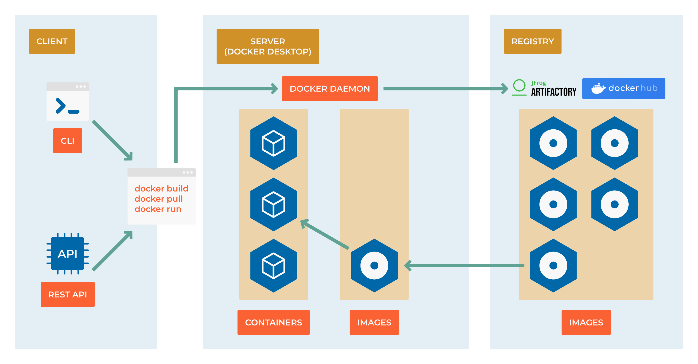

##########################
8.4 Creating Custom Images
##########################

**From Consumer to Creator**

So far, you've been running containers from images created by others. Now comes the transformative moment: learning to build your own custom images. This is where containers become truly powerful - you can package your applications exactly how you want them, ensuring consistency across all environments.

Think of this as learning to cook rather than just ordering takeout. Once you master Dockerfiles, you control every ingredient in your application's environment.

===================
Learning Objectives
===================

By the end of this section, you will:

• **Write** production-ready Dockerfiles following security and efficiency best practices
• **Understand** Docker's layered filesystem and how to optimize build performance
• **Build** images for different types of applications (web apps, APIs, databases)
• **Implement** multi-stage builds to create smaller, more secure images
• **Debug** build failures and optimize Docker image sizes
• **Apply** security hardening techniques to your container images

**Prerequisites:** Understanding of basic container operations and command-line familiarity

=======================
Dockerfile Fundamentals
=======================

**What is a Dockerfile?**

A Dockerfile is a text file containing a series of instructions that Docker uses to automatically build an image. It's like a recipe that specifies:

- The base operating system or runtime
- Application dependencies to install
- Files to copy into the image
- Environment variables to set
- Commands to run when the container starts

**The Anatomy of a Dockerfile:**

.. code-block:: dockerfile

    # Syntax: FROM <image>:<tag>
    FROM python:3.11-slim
    
    # Syntax: LABEL <key>=<value>
    LABEL maintainer="yourname@company.com"
    LABEL version="1.0"
    
    # Syntax: WORKDIR <path>
    WORKDIR /app
    
    # Syntax: COPY <src> <dest>
    COPY requirements.txt .
    
    # Syntax: RUN <command>
    RUN pip install --no-cache-dir -r requirements.txt
    
    # Syntax: COPY <src> <dest>
    COPY . .
    
    # Syntax: EXPOSE <port>
    EXPOSE 8000
    
    # Syntax: CMD ["executable", "param1", "param2"]
    CMD ["python", "app.py"]

=======================
Your First Custom Image
=======================

**Building a Python Web Application**

Let's create a complete web application image step by step:

**Step 1: Create the Application**

.. code-block:: python

    # app.py - Simple Flask web application
    from flask import Flask, jsonify
    import os
    import platform
    
    app = Flask(__name__)
    
    @app.route('/')
    def home():
        return jsonify({
            'message': 'Hello from containerized Flask!',
            'hostname': platform.node(),
            'python_version': platform.python_version(),
            'environment': os.environ.get('APP_ENV', 'development')
        })
    
    @app.route('/health')
    def health():
        return jsonify({'status': 'healthy'}), 200
    
    if __name__ == '__main__':
        app.run(host='0.0.0.0', port=8000, debug=False)

**Step 2: Define Dependencies**

.. code-block:: text

    # requirements.txt
    Flask==2.3.3
    gunicorn==21.2.0

**Step 3: Write the Dockerfile**

.. code-block:: dockerfile

    # Use Python 3.11 on slim Debian base (smaller than full Python image)
    FROM python:3.11-slim
    
    # Add metadata to the image
    LABEL maintainer="devops-team@company.com"
    LABEL description="Flask web application demo"
    LABEL version="1.0.0"
    
    # Create a non-root user for security
    RUN groupadd -r appuser && useradd -r -g appuser appuser
    
    # Set working directory
    WORKDIR /app
    
    # Copy requirements first (for better caching)
    COPY requirements.txt .
    
    # Install Python dependencies
    RUN pip install --no-cache-dir --upgrade pip && \
        pip install --no-cache-dir -r requirements.txt
    
    # Copy application code
    COPY app.py .
    
    # Change ownership to non-root user
    RUN chown -R appuser:appuser /app
    USER appuser
    
    # Expose port (documentation only, doesn't actually publish)
    EXPOSE 8000
    
    # Health check to monitor container status
    HEALTHCHECK --interval=30s --timeout=3s --start-period=5s --retries=3 \
        CMD curl -f http://localhost:8000/health || exit 1
    
    # Set environment variables
    ENV APP_ENV=production
    ENV FLASK_APP=app.py
    
    # Use exec form for proper signal handling
    CMD ["python", "app.py"]

**Step 4: Build and Test**

.. code-block:: bash

    # Build the image
    docker build -t my-flask-app:1.0 .
    
    # Run the container
    docker run -d -p 8000:8000 --name flask-demo my-flask-app:1.0
    
    # Test the application
    curl http://localhost:8000
    curl http://localhost:8000/health
    
    # Check container health
    docker ps
    docker logs flask-demo

=================================
Dockerfile Instructions Deep Dive
=================================

**Essential Instructions**

**FROM - Choose Your Foundation**

.. code-block:: dockerfile

    # Official language runtimes
    FROM python:3.11-slim        # Python with minimal OS
    FROM node:18-alpine          # Node.js on Alpine Linux (tiny)
    FROM openjdk:17-jre-slim     # Java runtime only
    
    # Operating systems
    FROM ubuntu:22.04            # Full Ubuntu system
    FROM alpine:3.18             # Minimal Linux (5MB)
    FROM scratch                 # Empty image (for static binaries)
    
    # Application-specific bases
    FROM nginx:alpine            # Web server ready
    FROM postgres:15             # Database ready

**RUN - Execute Commands**

.. code-block:: dockerfile

    # Single command
    RUN apt-get update
    
    # Multiple commands (creates multiple layers)
    RUN apt-get update
    RUN apt-get install -y curl
    RUN apt-get clean
    
    # Better: Chain commands (single layer)
    RUN apt-get update && \
        apt-get install -y curl && \
        apt-get clean && \
        rm -rf /var/lib/apt/lists/*
    
    # Use here documents for complex scripts
    RUN <<EOF
    apt-get update
    apt-get install -y python3 python3-pip
    pip3 install --upgrade pip
    rm -rf /var/lib/apt/lists/*
    EOF

**COPY vs ADD**

.. code-block:: dockerfile

    # COPY: Simple file copying (preferred)
    COPY app.py /app/
    COPY requirements.txt /app/
    COPY . /app/                 # Copy entire context
    
    # ADD: COPY plus extra features (use sparingly)
    ADD app.tar.gz /app/         # Automatically extracts archives
    ADD https://example.com/file.txt /app/  # Downloads URLs
    
    # Best practice: Use COPY unless you need ADD's special features

**Environment and Configuration**

.. code-block:: dockerfile

    # Set environment variables
    ENV NODE_ENV=production
    ENV API_URL=https://api.example.com
    ENV DEBUG=false
    
    # Set build-time variables
    ARG VERSION=latest
    ARG BUILD_DATE
    
    # Use ARG in RUN commands
    RUN echo "Building version $VERSION on $BUILD_DATE"
    
    # Working directory
    WORKDIR /app                 # Creates directory if it doesn't exist
    WORKDIR /app/src            # Can be called multiple times

**User Security**

.. code-block:: dockerfile

    # Create and use non-root user
    RUN groupadd -r myapp && useradd -r -g myapp myapp
    USER myapp
    
    # Or use numeric UID (works across all systems)
    RUN groupadd -r myapp && useradd -r -g myapp -u 1001 myapp
    USER 1001:1001

==================
Multi-Stage Builds
==================

**The Problem with Single-Stage Builds**

Traditional Dockerfiles include build tools in the final image:

.. code-block:: dockerfile

    # Problematic: Final image includes build tools (larger, less secure)
    FROM node:18
    WORKDIR /app
    COPY package*.json ./
    RUN npm install              # Includes devDependencies
    COPY . .
    RUN npm run build           # Build tools remain in image
    CMD ["npm", "start"]

**The Multi-Stage Solution**

.. code-block:: dockerfile

    # Stage 1: Build environment
    FROM node:18 AS builder
    WORKDIR /app
    COPY package*.json ./
    RUN npm ci --only=production
    COPY . .
    RUN npm run build
    
    # Stage 2: Production runtime
    FROM node:18-alpine AS production
    RUN addgroup -g 1001 -S nodejs && \
        adduser -S nextjs -u 1001
    WORKDIR /app
    
    # Copy only production files from builder stage
    COPY --from=builder --chown=nextjs:nodejs /app/dist ./dist
    COPY --from=builder --chown=nextjs:nodejs /app/node_modules ./node_modules
    COPY --from=builder --chown=nextjs:nodejs /app/package.json ./package.json
    
    USER nextjs
    EXPOSE 3000
    CMD ["npm", "start"]

**Real-World Multi-Stage Example: Go Application**

.. code-block:: dockerfile

    # Build stage
    FROM golang:1.21-alpine AS builder
    WORKDIR /app
    
    # Copy go mod files
    COPY go.mod go.sum ./
    RUN go mod download
    
    # Copy source and build
    COPY . .
    RUN CGO_ENABLED=0 GOOS=linux go build -a -installsuffix cgo -o main .
    
    # Final stage - minimal image
    FROM alpine:3.18
    RUN apk --no-cache add ca-certificates
    WORKDIR /root/
    
    # Copy only the binary
    COPY --from=builder /app/main .
    
    CMD ["./main"]

**Benefits of Multi-Stage Builds:**

- **Smaller images:** Final image only contains runtime dependencies
- **Better security:** No build tools in production image
- **Faster deployments:** Smaller images transfer faster
- **Cost savings:** Less storage and bandwidth usage

=======================
Optimization Techniques
=======================

**Layer Caching Strategies**

Docker caches layers to speed up builds. Optimize by ordering instructions from least to most frequently changed:

.. code-block:: dockerfile

    # GOOD: Stable layers first
    FROM python:3.11-slim
    
    # Install system dependencies (rarely change)
    RUN apt-get update && apt-get install -y \
        curl \
        && rm -rf /var/lib/apt/lists/*
    
    # Copy requirements file (changes occasionally)
    COPY requirements.txt .
    
    # Install Python packages (changes occasionally)
    RUN pip install -r requirements.txt
    
    # Copy source code (changes frequently)
    COPY . .
    
    # BAD: Frequently changing layers first
    FROM python:3.11-slim
    COPY . .                     # Code changes invalidate all subsequent layers
    RUN apt-get update && ...    # Reinstalls every time
    RUN pip install -r requirements.txt  # Reinstalls every time

**Minimize Image Size**

.. code-block:: dockerfile

    # Use Alpine Linux base images
    FROM python:3.11-alpine
    
    # Clean package caches in the same RUN command
    RUN apk add --no-cache \
        build-base \
        && pip install numpy \
        && apk del build-base    # Remove build dependencies after use
    
    # Use .dockerignore file to exclude unnecessary files
    # .dockerignore:
    # node_modules
    # .git
    # README.md
    # .env.example
    
    # Remove package manager caches
    RUN apt-get update && apt-get install -y \
        package1 package2 \
        && apt-get clean \
        && rm -rf /var/lib/apt/lists/*

**Security Best Practices**

.. code-block:: dockerfile

    # Use specific tags, not 'latest'
    FROM python:3.11.5-slim
    
    # Scan base images for vulnerabilities
    # Use tools like trivy: trivy image python:3.11.5-slim
    
    # Run as non-root user
    RUN groupadd -r app && useradd -r -g app app
    USER app
    
    # Don't store secrets in images
    # BAD:
    # ENV API_KEY=secret123
    # GOOD: Use runtime environment variables or secrets management
    
    # Use COPY instead of ADD when possible
    COPY requirements.txt .      # Explicit and predictable
    
    # Set read-only root filesystem
    # docker run --read-only -v /tmp:/tmp:rw my-app

============================
Advanced Dockerfile Patterns
============================

**Dynamic Build Arguments**

.. code-block:: dockerfile

    ARG NODE_VERSION=18
    FROM node:${NODE_VERSION}-alpine
    
    ARG BUILD_DATE
    ARG GIT_COMMIT
    LABEL build_date=$BUILD_DATE
    LABEL git_commit=$GIT_COMMIT
    
    # Use during build:
    # docker build --build-arg BUILD_DATE=$(date -u +'%Y-%m-%dT%H:%M:%SZ') \
    #              --build-arg GIT_COMMIT=$(git rev-parse HEAD) \
    #              -t my-app .

**Health Checks**

.. code-block:: dockerfile

    # Basic HTTP health check
    HEALTHCHECK --interval=30s --timeout=3s --start-period=5s --retries=3 \
        CMD curl -f http://localhost:8000/health || exit 1
    
    # Custom health check script
    COPY healthcheck.sh /usr/local/bin/
    RUN chmod +x /usr/local/bin/healthcheck.sh
    HEALTHCHECK --interval=30s --timeout=10s --start-period=5s --retries=3 \
        CMD healthcheck.sh

**Signal Handling**

.. code-block:: dockerfile

    # GOOD: Use exec form for proper signal handling
    CMD ["python", "app.py"]
    
    # BAD: Shell form doesn't handle signals properly
    CMD python app.py
    
    # For shell scripts, use exec:
    #!/bin/bash
    # setup.sh
    echo "Starting application..."
    exec python app.py

======================
Debugging Build Issues
======================

**Common Build Failures**

**Permission Issues:**

.. code-block:: dockerfile

    # Problem: Files copied as root, but running as user
    COPY app.py /app/
    USER 1001
    # Solution: Change ownership
    COPY --chown=1001:1001 app.py /app/

**Network Issues During Build:**

.. code-block:: dockerfile

    # Problem: Network timeouts during package installation
    # Solution: Add retries and use different mirrors
    RUN for i in 1 2 3; do \
        apt-get update && break || sleep 15; \
    done

**Debugging Techniques:**

.. code-block:: bash

    # Build with no cache to see all steps
    docker build --no-cache -t my-app .
    
    # Build and stop at specific stage for inspection
    docker build --target builder -t debug-build .
    docker run -it debug-build /bin/bash
    
    # Check build history and layer sizes
    docker history my-app
    docker images --format "table {{.Repository}}\t{{.Tag}}\t{{.Size}}"

==============================
Production Dockerfile Template
==============================

Here's a production-ready template for a Python web application:

.. code-block:: dockerfile

    # syntax=docker/dockerfile:1.4
    
    # Build stage
    FROM python:3.11-slim as builder
    
    # Install system dependencies for building
    RUN apt-get update && apt-get install -y \
        build-essential \
        curl \
        && rm -rf /var/lib/apt/lists/*
    
    # Create virtual environment
    RUN python -m venv /opt/venv
    ENV PATH="/opt/venv/bin:$PATH"
    
    # Copy and install Python dependencies
    COPY requirements.txt .
    RUN pip install --upgrade pip && \
        pip install --no-cache-dir -r requirements.txt
    
    # Production stage
    FROM python:3.11-slim as production
    
    # Create non-root user
    RUN groupadd -r appuser && \
        useradd -r -g appuser -u 1001 appuser
    
    # Install runtime dependencies only
    RUN apt-get update && apt-get install -y \
        curl \
        && rm -rf /var/lib/apt/lists/*
    
    # Copy virtual environment from builder stage
    COPY --from=builder /opt/venv /opt/venv
    ENV PATH="/opt/venv/bin:$PATH"
    
    # Set up application directory
    WORKDIR /app
    COPY --chown=appuser:appuser . .
    
    # Security and runtime configuration
    USER appuser
    EXPOSE 8000
    
    # Health check
    HEALTHCHECK --interval=30s --timeout=3s --start-period=5s --retries=3 \
        CMD curl -f http://localhost:8000/health || exit 1
    
    # Use exec form and run as non-root
    CMD ["gunicorn", "--bind", "0.0.0.0:8000", "--workers", "4", "app:app"]

===================
Practical Exercises
===================

**Exercise 1: Multi-Stage Node.js Build**

Create a Dockerfile for a React application with separate build and production stages.

**Exercise 2: Database with Custom Configuration**

Build a PostgreSQL image with custom configuration and initialization scripts.

**Exercise 3: Security Hardening**

Take an existing Dockerfile and apply security best practices: non-root user, minimal packages, vulnerability scanning.

==============
What's Next?
==============

You now understand how to create custom container images that are secure, efficient, and production-ready. In the next section, we'll explore container orchestration with Docker Compose to manage multi-container applications.

**Key takeaways:**

- Dockerfiles define repeatable, version-controlled environments
- Multi-stage builds create smaller, more secure images
- Layer caching and optimization techniques speed up builds
- Security practices are essential for production images
- Health checks and proper signal handling improve reliability

.. tip::

    **Pro Tip:** Start with working Dockerfiles and iteratively optimize them. Perfect is the enemy of good - a working container is better than a perfect container that doesn't exist yet.