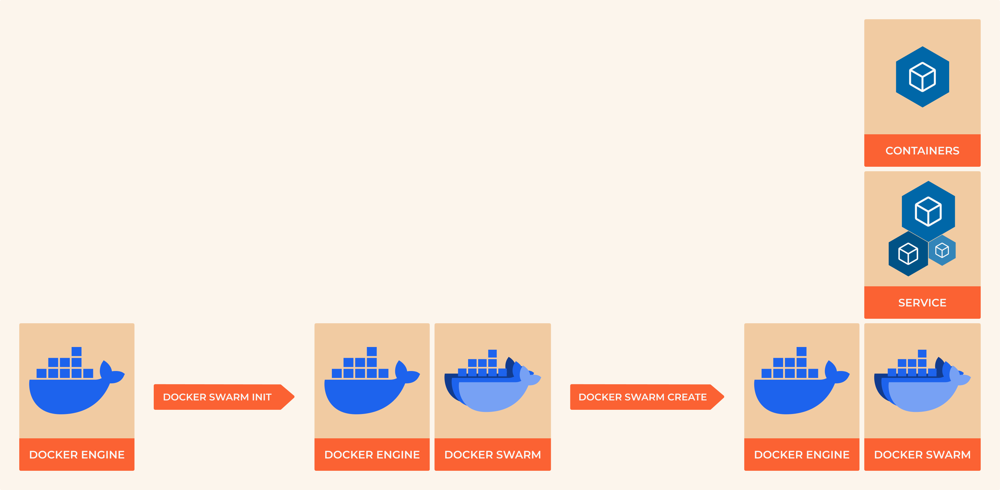

###########################
8.6 Container Orchestration
###########################

**From Single Containers to Applications**

Running individual containers is like assembling a car one bolt at a time. Modern applications consist of multiple services that need to work together: web servers, databases, caches, message queues, and more. Container orchestration tools coordinate these services, handling networking, scaling, health monitoring, and updates automatically.

This section covers Docker Compose for development and testing, plus an introduction to production orchestration concepts that lead into Kubernetes.

===================
Learning Objectives
===================

By the end of this section, you will:

• **Define** multi-container applications using Docker Compose
• **Manage** application lifecycles with compose commands
• **Configure** inter-service networking and data persistence
• **Implement** development workflows with live code reloading
• **Understand** the progression from Compose to production orchestration
• **Deploy** applications to Docker Swarm for high availability

**Prerequisites:** Understanding of Dockerfiles, container networking basics, and YAML syntax

=========================
Why Orchestration Matters
=========================

**The Multi-Container Challenge**

Modern applications face several complexity challenges:

- **Service Discovery:** How does the web app find the database?
- **Load Balancing:** How do you distribute traffic across multiple instances?
- **Health Monitoring:** What happens when a service crashes?
- **Rolling Updates:** How do you update services without downtime?
- **Resource Management:** How do you ensure services get the resources they need?
- **Configuration Management:** How do you handle different environments?

**Orchestration Solutions Landscape:**

.. list-table::
   :header-rows: 1
   :widths: 25 25 25 25

   * - Tool
     - Best For
     - Complexity
     - Scale
   * - **Docker Compose**
     - Development, Testing
     - Low
     - Single Host
   * - **Docker Swarm**
     - Simple Production
     - Medium
     - Multi-Host
   * - **Kubernetes**
     - Enterprise Production
     - High
     - Massive Scale
   * - **Nomad**
     - Mixed Workloads
     - Medium
     - Multi-Cloud

========================
Docker Compose Deep Dive
========================

**What is Docker Compose?**

Docker Compose is a tool for defining and running multi-container applications. You describe your entire application stack in a single YAML file, then bring it up with one command.

**Core Concepts:**

- **Services:** Individual containers that make up your application
- **Networks:** Communication channels between services
- **Volumes:** Persistent data storage shared between containers
- **Environment:** Configuration that changes between deployments

**A Real-World Example: Full-Stack Web Application**

Let's build a complete web application with frontend, backend, database, and cache:

**Project Structure:**

.. code-block:: text

    web-app/
    ├── docker-compose.yml
    ├── frontend/
    │   ├── Dockerfile
    │   ├── package.json
    │   └── src/
    ├── backend/
    │   ├── Dockerfile
    │   ├── requirements.txt
    │   └── app.py
    └── nginx/
        └── nginx.conf

**Backend API (Flask):**

.. code-block:: python

    # backend/app.py
    from flask import Flask, jsonify, request
    from flask_cors import CORS
    import redis
    import psycopg2
    import os
    
    app = Flask(__name__)
    CORS(app)
    
    # Database connection
    def get_db():
        return psycopg2.connect(
            host=os.environ.get('DB_HOST', 'postgres'),
            database=os.environ.get('DB_NAME', 'webapp'),
            user=os.environ.get('DB_USER', 'postgres'),
            password=os.environ.get('DB_PASSWORD', 'password')
        )
    
    # Redis connection
    cache = redis.Redis(
        host=os.environ.get('REDIS_HOST', 'redis'),
        port=6379,
        decode_responses=True
    )
    
    @app.route('/api/health')
    def health_check():
        return jsonify({'status': 'healthy', 'service': 'backend'})
    
    @app.route('/api/users', methods=['GET', 'POST'])
    def users():
        if request.method == 'POST':
            data = request.json
            # Store in database
            conn = get_db()
            cursor = conn.cursor()
            cursor.execute(
                "INSERT INTO users (name, email) VALUES (%s, %s) RETURNING id",
                (data['name'], data['email'])
            )
            user_id = cursor.fetchone()[0]
            conn.commit()
            conn.close()
            
            # Cache the user
            cache.set(f"user:{user_id}", data['name'], ex=3600)
            
            return jsonify({'id': user_id, 'message': 'User created'}), 201
        
        else:
            # Get from database
            conn = get_db()
            cursor = conn.cursor()
            cursor.execute("SELECT id, name, email FROM users")
            users = cursor.fetchall()
            conn.close()
            
            return jsonify([
                {'id': u[0], 'name': u[1], 'email': u[2]} for u in users
            ])
    
    if __name__ == '__main__':
        app.run(host='0.0.0.0', port=5000, debug=True)

**Backend Dockerfile:**

.. code-block:: dockerfile

    # backend/Dockerfile
    FROM python:3.11-slim
    
    WORKDIR /app
    
    # Install system dependencies
    RUN apt-get update && apt-get install -y \
        gcc \
        postgresql-client \
        && rm -rf /var/lib/apt/lists/*
    
    # Install Python dependencies
    COPY requirements.txt .
    RUN pip install --no-cache-dir -r requirements.txt
    
    # Copy application code
    COPY . .
    
    EXPOSE 5000
    
    CMD ["python", "app.py"]

**Requirements file:**

.. code-block:: text

    # backend/requirements.txt
    Flask==2.3.3
    Flask-CORS==4.0.0
    redis==5.0.0
    psycopg2-binary==2.9.7

**The Complete docker-compose.yml:**

.. code-block:: yaml

    version: '3.8'
    
    services:
      # Frontend (React/nginx)
      frontend:
        build:
          context: ./frontend
          dockerfile: Dockerfile
        ports:
          - "3000:80"
        depends_on:
          - backend
        environment:
          - REACT_APP_API_URL=http://localhost:5000
        networks:
          - app-network
    
      # Backend API
      backend:
        build:
          context: ./backend
          dockerfile: Dockerfile
        ports:
          - "5000:5000"
        environment:
          - DB_HOST=postgres
          - DB_NAME=webapp
          - DB_USER=postgres
          - DB_PASSWORD=securepassword
          - REDIS_HOST=redis
        depends_on:
          postgres:
            condition: service_healthy
          redis:
            condition: service_started
        volumes:
          - ./backend:/app  # Hot reload for development
        networks:
          - app-network
    
      # PostgreSQL Database
      postgres:
        image: postgres:15-alpine
        environment:
          - POSTGRES_DB=webapp
          - POSTGRES_USER=postgres
          - POSTGRES_PASSWORD=securepassword
        volumes:
          - postgres_data:/var/lib/postgresql/data
          - ./init.sql:/docker-entrypoint-initdb.d/init.sql:ro
        healthcheck:
          test: ["CMD-SHELL", "pg_isready -U postgres"]
          interval: 10s
          timeout: 5s
          retries: 5
        networks:
          - app-network
    
      # Redis Cache
      redis:
        image: redis:7-alpine
        command: redis-server --appendonly yes
        volumes:
          - redis_data:/data
        healthcheck:
          test: ["CMD", "redis-cli", "ping"]
          interval: 10s
          timeout: 3s
          retries: 5
        networks:
          - app-network
    
      # Reverse Proxy (Production)
      nginx:
        image: nginx:alpine
        ports:
          - "80:80"
        volumes:
          - ./nginx/nginx.conf:/etc/nginx/nginx.conf:ro
        depends_on:
          - frontend
          - backend
        networks:
          - app-network
    
    # Persistent storage
    volumes:
      postgres_data:
        driver: local
      redis_data:
        driver: local
    
    # Custom network for service communication
    networks:
      app-network:
        driver: bridge
        ipam:
          config:
            - subnet: 172.20.0.0/16

**Database Initialization:**

.. code-block:: sql

    -- init.sql
    CREATE TABLE IF NOT EXISTS users (
        id SERIAL PRIMARY KEY,
        name VARCHAR(100) NOT NULL,
        email VARCHAR(100) UNIQUE NOT NULL,
        created_at TIMESTAMP DEFAULT CURRENT_TIMESTAMP
    );
    
    INSERT INTO users (name, email) VALUES 
    ('Alice Johnson', 'alice@example.com'),
    ('Bob Smith', 'bob@example.com');

========================
Compose Commands Mastery
========================

**Essential Lifecycle Commands:**

.. code-block:: bash

    # Start the entire application
    docker-compose up
    
    # Start in background (detached mode)
    docker-compose up -d
    
    # Build images before starting
    docker-compose up --build
    
    # Start specific services only
    docker-compose up frontend backend
    
    # View running services
    docker-compose ps
    
    # View service logs
    docker-compose logs
    docker-compose logs -f backend  # Follow logs for specific service
    
    # Stop services gracefully
    docker-compose stop
    
    # Stop and remove containers, networks, volumes
    docker-compose down
    
    # Remove everything including volumes (destructive!)
    docker-compose down -v

**Development Workflow Commands:**

.. code-block:: bash

    # Rebuild a specific service
    docker-compose build backend
    
    # Restart a service (useful after code changes)
    docker-compose restart backend
    
    # Scale services horizontally
    docker-compose up --scale backend=3
    
    # Execute commands in running containers
    docker-compose exec backend python manage.py migrate
    docker-compose exec postgres psql -U postgres webapp
    
    # Run one-off commands
    docker-compose run backend python -c "print('Hello from container')"

**Monitoring and Debugging:**

.. code-block:: bash

    # View resource usage
    docker-compose top
    
    # Monitor logs from all services
    docker-compose logs -f
    
    # Check service health
    docker-compose ps --services --filter "status=running"
    
    # Get IP addresses of services
    docker-compose exec backend nslookup postgres

=========================
Advanced Compose Features
=========================

**Environment-Specific Configurations**

**Base compose file (docker-compose.yml):**

.. code-block:: yaml

    version: '3.8'
    services:
      backend:
        build: ./backend
        environment:
          - DB_HOST=postgres
        volumes:
          - ./backend:/app

**Development override (docker-compose.override.yml):**

.. code-block:: yaml

    version: '3.8'
    services:
      backend:
        environment:
          - DEBUG=true
          - LOG_LEVEL=debug
        ports:
          - "5000:5000"

**Production override (docker-compose.prod.yml):**

.. code-block:: yaml

    version: '3.8'
    services:
      backend:
        environment:
          - DEBUG=false
          - LOG_LEVEL=warning
        deploy:
          replicas: 3
          resources:
            limits:
              memory: 512M
            reservations:
              memory: 256M

**Usage:**

.. code-block:: bash

    # Development (uses override.yml automatically)
    docker-compose up
    
    # Production
    docker-compose -f docker-compose.yml -f docker-compose.prod.yml up

**Secrets Management:**

.. code-block:: yaml

    # Use external secrets (Docker Swarm)
    secrets:
      db_password:
        external: true
    
    services:
      backend:
        secrets:
          - db_password
        environment:
          - DB_PASSWORD_FILE=/run/secrets/db_password

**Health Checks and Dependencies:**

.. code-block:: yaml

    services:
      postgres:
        healthcheck:
          test: ["CMD-SHELL", "pg_isready"]
          interval: 30s
          timeout: 10s
          retries: 3
          start_period: 60s
      
      backend:
        depends_on:
          postgres:
            condition: service_healthy

=========================
Production Considerations
=========================

**Resource Limits and Constraints:**

.. code-block:: yaml

    services:
      backend:
        deploy:
          resources:
            limits:
              cpus: '2.0'
              memory: 1G
            reservations:
              cpus: '1.0'
              memory: 512M
          restart_policy:
            condition: on-failure
            delay: 5s
            max_attempts: 3

**Logging Configuration:**

.. code-block:: yaml

    services:
      backend:
        logging:
          driver: "json-file"
          options:
            max-size: "10m"
            max-file: "3"

**Security Hardening:**

.. code-block:: yaml

    services:
      backend:
        user: "1000:1000"  # Non-root user
        read_only: true     # Read-only root filesystem
        tmpfs:
          - /tmp            # Writable temporary filesystem
        security_opt:
          - no-new-privileges:true

=========================
Docker Swarm Introduction
=========================

**When to Use Swarm vs Kubernetes**

Docker Swarm is Docker's native clustering solution:

**Swarm Advantages:**

- **Simple setup:** Easy to learn if you know Docker Compose
- **Built-in:** Comes with Docker Engine
- **Familiar syntax:** Uses compose file format
- **Good enough:** Handles most production scenarios

**Kubernetes Advantages:**

- **Feature-rich:** More advanced scheduling and networking
- **Ecosystem:** Vast ecosystem of tools and operators
- **Industry standard:** Most cloud providers have managed Kubernetes
- **Flexibility:** Supports complex deployment patterns

**Basic Swarm Setup:**

.. code-block:: bash

    # Initialize a swarm (on manager node)
    docker swarm init
    
    # Join worker nodes (run on worker machines)
    docker swarm join --token <worker-token> <manager-ip>:2377
    
    # Deploy compose application to swarm
    docker stack deploy -c docker-compose.yml myapp
    
    # List stacks
    docker stack ls
    
    # List services in a stack
    docker stack services myapp
    
    # Check service logs
    docker service logs myapp_backend
    
    # Scale a service
    docker service scale myapp_backend=5
    
    # Remove stack
    docker stack rm myapp

==========================
Development Best Practices
==========================

**Project Organization:**

.. code-block:: text

    project/
    ├── docker-compose.yml          # Main compose file
    ├── docker-compose.override.yml # Development overrides
    ├── docker-compose.prod.yml     # Production config
    ├── .env                        # Environment variables
    ├── .env.example               # Template for environment vars
    ├── services/
    │   ├── frontend/
    │   ├── backend/
    │   └── database/
    └── docs/
        └── deployment.md

**Environment Variables:**

.. code-block:: bash

    # .env file
    COMPOSE_PROJECT_NAME=myapp
    POSTGRES_PASSWORD=dev_password_change_in_prod
    REDIS_URL=redis://redis:6379
    API_URL=http://localhost:5000

**Development Workflow:**

.. code-block:: bash

    # Initial setup
    git clone <repository>
    cd project
    cp .env.example .env
    # Edit .env with your values
    
    # Start development environment
    docker-compose up -d
    
    # Run tests
    docker-compose exec backend pytest
    
    # Access database
    docker-compose exec postgres psql -U postgres
    
    # View logs
    docker-compose logs -f backend
    
    # Clean shutdown
    docker-compose down

=====================
Troubleshooting Guide
=====================

**Common Issues and Solutions:**

**Services can't communicate:**

.. code-block:: bash

    # Check if services are on the same network
    docker network ls
    docker network inspect <network_name>
    
    # Test connectivity between services
    docker-compose exec frontend ping backend
    docker-compose exec backend nslookup postgres

**Port already in use:**

.. code-block:: bash

    # Find what's using the port
    lsof -i :5000  # macOS/Linux
    netstat -ano | findstr :5000  # Windows
    
    # Change port in compose file or stop conflicting service

**Permission issues with volumes:**

.. code-block:: yaml

    # Fix with user mapping
    services:
      backend:
        user: "${UID}:${GID}"
        volumes:
          - ./backend:/app

**Database connection issues:**

.. code-block:: bash

    # Check database is ready
    docker-compose exec postgres pg_isready
    
    # Check database logs
    docker-compose logs postgres
    
    # Test connection manually
    docker-compose exec backend python -c "
    import psycopg2
    conn = psycopg2.connect('host=postgres user=postgres password=password')
    print('Connected successfully')
    "

===================
Practical Exercises
===================

**Exercise 1: WordPress Stack**

Create a compose file for WordPress with MySQL and Redis cache.

**Exercise 2: Microservices Demo**

Build a microservices application with API gateway, user service, and product service.

**Exercise 3: Development Environment**

Set up a development environment with hot reloading, test database, and debugging tools.

============
What's Next?
============

You now understand how to orchestrate multi-container applications for development and simple production scenarios. The next chapter covers container security, monitoring, and best practices for production deployments.

**Key takeaways:**

- Docker Compose simplifies multi-container application management
- Service discovery and networking are handled automatically
- Health checks and dependencies ensure proper startup order
- Environment-specific configurations enable dev/test/prod workflows
- Resource limits and logging are essential for production

.. note::

    **Production Path:** While Compose is great for development, production workloads typically benefit from Kubernetes for advanced features like auto-scaling, rolling updates, and multi-cluster deployments.

