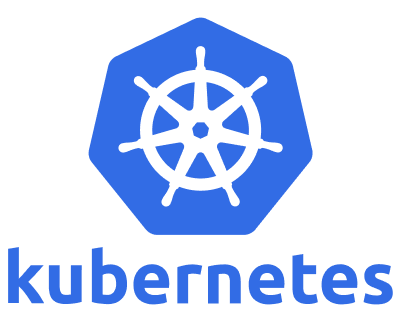

################
9.0 Introduction
################

**From Containers to Production Orchestration**

In the previous chapter, you learned to package applications into containers and orchestrate them locally with Docker Compose. You can now run multi-container applications with a simple `docker-compose up` command. But what happens when your application needs to handle thousands of users, run across multiple servers, and deploy updates without downtime?

This is where Kubernetes transforms your containerized applications into production-ready, scalable systems. Think of Kubernetes as "Docker Compose for production" - but with superpowers like automatic scaling, self-healing, and zero-downtime deployments.

**The Journey We'll Take:**
This introduction will take you from understanding *what* Kubernetes is to *how* it works internally, culminating in *why* it's essential for modern DevOps practices. You'll see practical examples that build on your Docker knowledge and discover how Kubernetes solves real production challenges.

===================
What is Kubernetes?
===================

**The Container Orchestration Platform**

Kubernetes (pronounced "koo-ber-net-eez", often shortened to "K8s") is an open-source platform that automates the deployment, scaling, and management of containerized applications across clusters of servers.

**Think of it this way:** If Docker is like having a powerful single-family home for your applications, Kubernetes is like managing an entire smart city of interconnected buildings, complete with traffic management, utilities, and emergency services.

**Core Philosophy - Declarative Management:**

Unlike traditional imperative approaches where you tell systems *how* to do something step-by-step, Kubernetes uses a **declarative model**. You describe the *desired state* of your applications, and Kubernetes continuously works to maintain that state.

.. code-block:: yaml

    # You declare: "I want 3 replicas of my web app running"
    apiVersion: apps/v1
    kind: Deployment
    metadata:
      name: web-app
    spec:
      replicas: 3  # Desired state
      selector:
        matchLabels:
          app: web-app
      template:
        metadata:
          labels:
            app: web-app
        spec:
          containers:
          - name: web
            image: nginx:latest
            ports:
            - containerPort: 80

**Kubernetes then ensures:** If a container crashes, it starts a new one. If a server fails, it moves containers to healthy servers. If traffic increases, it can automatically add more replicas.

**Key Capabilities:**

• **Automatic Scaling** - Add or remove containers based on traffic and resource usage
• **Self-Healing** - Restart failed containers and replace unhealthy nodes automatically
• **Zero-Downtime Deployments** - Update applications without service interruption using rolling updates
• **Service Discovery** - Containers find each other automatically using DNS and service names
• **Load Balancing** - Distribute traffic intelligently across multiple container instances
• **Configuration Management** - Separate application code from configuration using ConfigMaps and Secrets
• **Secrets Management** - Handle sensitive data like passwords and API keys securely
• **Resource Management** - Efficiently allocate CPU, memory, and storage across the cluster

**The Google Connection - From Borg to Kubernetes**

Kubernetes didn't emerge from nowhere. It's built on over a decade of Google's experience running containers at massive scale. For years, Google has been operating billions of containers weekly using internal systems called **Borg** and **Omega**.

While Kubernetes isn't a direct open-source version of these systems, it incorporates the hard-learned lessons from managing containerized workloads that serve billions of users. Many of the engineers who built Borg and Omega were instrumental in creating Kubernetes, ensuring that Google's container orchestration expertise became available to everyone.

The name "Kubernetes" comes from the Greek word for "helmsman" - the person who steers a ship. This maritime theme is reflected in the logo's ship's wheel design. Interestingly, Kubernetes was originally going to be called "Seven of Nine" (a reference to the Star Trek character who was rescued from the Borg), but copyright issues led to the current name. The logo still subtly references this with its seven spokes.

**Why "K8s"?** The abbreviation replaces the eight letters between "K" and "s" with the number 8 - a common pattern in software naming.

===================
Learning Objectives
===================

By the end of this chapter, you will be able to:

• **Deploy** your containerized applications to Kubernetes clusters
• **Scale** applications automatically based on demand
• **Implement** zero-downtime deployments with rollback capabilities
• **Manage** application configuration and secrets securely
• **Integrate** Kubernetes with your CI/CD pipelines
• **Monitor** and troubleshoot applications in production
• **Apply** production best practices for security and performance

**Prerequisites:** Understanding of containers (Chapter 8), CI/CD pipelines (Chapter 7), and experience with Docker Compose.

========================
The Production Challenge
========================

**From Development to Scale**

Imagine this scenario: Your containerized application stack from the previous chapter is running successfully in production using Docker Compose. But as your user base grows, you're facing new challenges:

**Real-World Production Problems:**

.. code-block:: text

    Single Server Limitations
    Your Docker Compose setup runs on one server:
    - Traffic exceeds server capacity → Users see slow responses
    - Server hardware fails → Complete outage until manual recovery
    - Memory leaks in containers → Manual restart required
    
    Deployment Challenges  
    Updating applications requires downtime:
    - docker-compose down → Users can't access the application
    - docker-compose up → Hope everything works correctly
    - Rollback requires manual intervention and more downtime
    
    Scaling Nightmares
    Peak traffic requires manual intervention:
    - Monitor server resources manually
    - Edit docker-compose.yml to add replicas
    - Restart entire stack to apply changes
    - No automatic scale-down when traffic decreases

**What You Need: Production-Grade Orchestration**

You've mastered containers and CI/CD pipelines, but now you need a solution that can:

- **Automatically scale** your applications across multiple servers
- **Handle failures gracefully** without manual intervention  
- **Deploy updates** without any downtime
- **Integrate seamlessly** with your existing automation
- **Provide enterprise-grade** security and monitoring

This is where Kubernetes transforms from a nice-to-have tool into an essential platform for modern applications.

**Docker Compose vs. Kubernetes - The Evolution:**

.. list-table::
   :header-rows: 1
   :widths: 30 35 35

   * - Challenge
     - Docker Compose Solution
     - Kubernetes Solution
   * - **Multiple Servers**
     - Single host only
     - Manages entire clusters of servers
   * - **High Availability**
     - Manual setup, single point of failure
     - Built-in failover and self-healing
   * - **Automatic Scaling**
     - Manual replica adjustment
     - Auto-scale based on CPU, memory, custom metrics
   * - **Rolling Updates**
     - Stop/start deployments (downtime)
     - Zero-downtime rolling updates with rollback
   * - **Load Balancing**
     - Basic port mapping
     - Advanced traffic management and service mesh
   * - **Health Monitoring**
     - Basic restart policies
     - Comprehensive health checks and observability
   * - **Configuration**
     - Environment files and volumes
     - ConfigMaps, Secrets, and policy management
   * - **Storage**
     - Local volumes only
     - Distributed persistent volumes across cluster

**Migration Example - Your Web Application:**

Your current Docker Compose setup:

.. code-block:: yaml

    # docker-compose.yml - Single server, basic orchestration
    version: '3.8'
    services:
      web:
        image: myapp:latest
        ports:
          - "8080:8080"
        environment:
          - DATABASE_URL=postgres://user:pass@db:5432/myapp
        depends_on:
          - database
        restart: unless-stopped
      
      database:
        image: postgres:13
        environment:
          - POSTGRES_DB=myapp
          - POSTGRES_USER=user
          - POSTGRES_PASSWORD=pass
        volumes:
          - postgres_data:/var/lib/postgresql/data

**Kubernetes equivalent - Production-ready orchestration:**

.. code-block:: yaml

    # web-deployment.yaml - Scalable, self-healing application
    apiVersion: apps/v1
    kind: Deployment
    metadata:
      name: web-app
    spec:
      replicas: 3  # Multiple instances for reliability
      selector:
        matchLabels:
          app: web-app
      template:
        metadata:
          labels:
            app: web-app
        spec:
          containers:
          - name: web
            image: myapp:latest
            ports:
            - containerPort: 8080
            env:
            - name: DATABASE_URL
              valueFrom:
                secretKeyRef:  # Secure configuration management
                  name: db-config
                  key: url
            readinessProbe:  # Health checking for zero-downtime deployments
              httpGet:
                path: /health
                port: 8080
              initialDelaySeconds: 10
            livenessProbe:   # Self-healing - restart unhealthy containers
              httpGet:
                path: /health
                port: 8080
              initialDelaySeconds: 30
            resources:       # Resource management and auto-scaling
              requests:
                memory: "256Mi"
                cpu: "250m"
              limits:
                memory: "512Mi"
                cpu: "500m"

**What Kubernetes Adds:**

- **3 replicas** instead of 1 - if one fails, two others keep serving traffic
- **Health checks** - automatic restart of unhealthy containers
- **Resource limits** - prevent one container from consuming all server resources
- **Secret management** - database credentials stored securely, not in plain text
- **Rolling updates** - deploy new versions without downtime
- **Auto-scaling** - add more replicas when CPU usage is high

This is the power of Kubernetes: the same application, but with enterprise-grade reliability, security, and scalability built in.

====================
How Kubernetes Works
====================

**The Control Loop Pattern**

At its heart, Kubernetes operates on a simple but powerful principle: the **control loop**. This pattern continuously monitors the actual state of your applications and compares it to your desired state, taking corrective actions when they differ.

**The Control Loop in Action:**

.. code-block:: text

    1. Observe → What's currently running?
    2. Compare → Does this match what I want?
    3. Act → Make changes to reach desired state
    4. Repeat → Continuously monitor and adjust

**Practical Example - Handling Pod Failures:**

Let's say you've declared that you want 3 replicas of your web application running:

.. code-block:: bash

    # Current state: 3 pods running
    $ kubectl get pods
    NAME                     READY   STATUS    RESTARTS
    web-app-7d5f8b4c-abc123  1/1     Running   0
    web-app-7d5f8b4c-def456  1/1     Running   0  
    web-app-7d5f8b4c-ghi789  1/1     Running   0

**Scenario: One server crashes and takes a pod with it**

.. code-block:: bash

    # Current state: Only 2 pods running
    $ kubectl get pods
    NAME                     READY   STATUS    RESTARTS
    web-app-7d5f8b4c-abc123  1/1     Running   0
    web-app-7d5f8b4c-def456  1/1     Running   0
    web-app-7d5f8b4c-ghi789  0/1     Pending   0  # Being recreated

**Kubernetes automatically detects the difference:**
- **Desired state:** 3 running pods
- **Actual state:** 2 running pods  
- **Action:** Create a new pod on a healthy server

Within seconds, you're back to 3 running pods without any manual intervention.

**The Distributed Architecture**

Kubernetes achieves this through a distributed architecture with specialized components:

**Control Plane Components (The "Brain"):**

The control plane makes all the decisions about your cluster:

• **API Server** - The central command center that handles all requests and communications
• **etcd** - A distributed database that stores all cluster configuration and state information
• **Scheduler** - Intelligently decides which server should run each new container
• **Controller Manager** - Runs the control loops that ensure desired state matches actual state

**Worker Node Components (The "Muscle"):**

Worker nodes do the actual work of running your applications:

• **kubelet** - The agent that communicates with the control plane and manages containers on each node
• **Container Runtime** - The software that actually runs containers (containerd, CRI-O, etc.)
• **kube-proxy** - Handles networking, load balancing, and service discovery

**How They Work Together - A Deployment Example:**

.. code-block:: text

    1. You: kubectl apply -f deployment.yaml
       ↓
    2. API Server: Receives request, validates, stores in etcd
       ↓  
    3. Controller Manager: Detects new deployment, creates pods
       ↓
    4. Scheduler: Decides which nodes should run the pods
       ↓
    5. kubelet: Receives pod assignment, pulls images, starts containers
       ↓
    6. kube-proxy: Sets up networking so pods can communicate
       ↓
    7. Result: Your application is running and accessible

**Why This Architecture Matters:**

This distributed design provides the reliability and scale that production applications require. If one worker node fails, your applications continue running on other nodes. If the control plane has multiple replicas, the cluster remains operational even if some control plane components fail.

=====================
Core Concepts Preview
=====================

**The Building Blocks in Action**

Now that you understand how Kubernetes works internally, let's preview the key objects you'll work with daily. These concepts replace and extend the services you defined in Docker Compose:

**Pods - The Atomic Unit:**
Groups of containers that work together and share networking and storage. Think of a Pod as a "logical host" for your application.

.. code-block:: yaml

    # A simple pod running a web server
    apiVersion: v1
    kind: Pod
    metadata:
      name: web-pod
    spec:
      containers:
      - name: web
        image: nginx:latest
        ports:
        - containerPort: 80

**Deployments - Managing Scale and Updates:**
Manage multiple copies of your Pods, handle updates, and ensure the right number of instances are always running.

.. code-block:: yaml

    # A deployment that ensures 3 replicas are always running
    apiVersion: apps/v1
    kind: Deployment
    metadata:
      name: web-deployment
    spec:
      replicas: 3
      selector:
        matchLabels:
          app: web
      template:
        metadata:
          labels:
            app: web
        spec:
          containers:
          - name: web
            image: nginx:latest

**Services - Stable Networking:**
Provide stable endpoints for your Pods, even as individual containers come and go.

.. code-block:: yaml

    # A service that load balances across all web pods
    apiVersion: v1
    kind: Service
    metadata:
      name: web-service
    spec:
      selector:
        app: web
      ports:
      - port: 80
        targetPort: 80
      type: LoadBalancer

**ConfigMaps and Secrets - Configuration Management:**
Store configuration data and sensitive information separately from your application code.

.. code-block:: yaml

    # Configuration stored separately from code
    apiVersion: v1
    kind: ConfigMap
    metadata:
      name: app-config
    data:
      database_host: "postgres.example.com"
      cache_size: "1024"

**Real-World Example - Complete Application Stack:**

Here's how these components work together to deploy a web application with a database:

.. code-block:: bash

    # The workflow you'll learn:
    kubectl apply -f database-deployment.yaml    # Deploy PostgreSQL
    kubectl apply -f database-service.yaml      # Expose database internally
    kubectl apply -f web-deployment.yaml        # Deploy web application  
    kubectl apply -f web-service.yaml           # Expose web app to users
    kubectl apply -f config-map.yaml            # Apply configuration

**What happens behind the scenes:**

1. Kubernetes creates database pods and a service for internal access
2. Web application pods start and connect to the database service
3. A load balancer service exposes the web application to external traffic
4. If any component fails, Kubernetes automatically restarts it
5. If traffic increases, you can easily scale by changing replica counts

**Practical Learning Approach:**

In the following sections, you'll work with these concepts hands-on:

1. **Getting Started** - Set up a local Kubernetes environment and deploy your first application
2. **Core Concepts** - Master Pods, Deployments, Services, and configuration management
3. **Production Deployments** - Connect your CI/CD pipelines to Kubernetes for automated deployments
4. **Package Management** - Use Helm to package and manage complex applications
5. **GitOps** - Automate deployments with ArgoCD for git-driven operations
6. **Best Practices** - Secure and optimize your clusters for production workloads

Each section builds on the previous one, using practical examples with applications you've built in earlier chapters, ensuring you can immediately apply these concepts to real projects.

================================
Kubernetes in the DevOps Context
================================

**Completing Your DevOps Pipeline**

In the pipelines chapter, you built CI/CD workflows that automatically test, build, and package applications. In the containers chapter, you learned to create portable, reliable application packages. Kubernetes is where these capabilities converge to create a complete DevOps platform.

**The Complete Pipeline Integration:**

.. code-block:: text

    Developer Push → GitHub Actions → Docker Build → Container Registry → Kubernetes Deploy
         ↓               ↓              ↓                ↓                    ↓
    Code commits → Automated tests → Image creation → Artifact storage → Production rollout

**Practical GitOps Workflow:**

.. code-block:: yaml

    # .github/workflows/deploy.yml
    name: Deploy to Kubernetes
    on:
      push:
        branches: [main]
    
    jobs:
      deploy:
        runs-on: ubuntu-latest
        steps:
          - uses: actions/checkout@v4
          
          - name: Build and push image
            run: |
              docker build -t myapp:${{ github.sha }} .
              docker push myregistry/myapp:${{ github.sha }}
          
          - name: Deploy to Kubernetes
            run: |
              kubectl set image deployment/web-app web=myapp:${{ github.sha }}
              kubectl rollout status deployment/web-app

**Integration Benefits:**

- **Traceability**: Every deployment links back to specific code commits
- **Consistency**: Same container runs in development, staging, and production  
- **Automation**: Zero manual deployment steps reduce human error
- **Rollback capability**: Previous versions remain available for instant rollback
- **Environment parity**: Identical deployment process across all environments

=====================
Ready to Get Started?
=====================

**Your Learning Journey Ahead**

You now understand:

- **What** Kubernetes is (container orchestration platform)
- **How** it works (control loops, distributed architecture, declarative management)
- **Why** you need it (production scale, reliability, automation)
- **Where** it fits (completing your DevOps pipeline)

In the next section, we'll move from theory to practice. You'll set up a local Kubernetes environment and deploy your first application, experiencing firsthand the power of declarative orchestration.

The journey from understanding why Kubernetes matters to deploying production applications starts with a single `kubectl apply` command. Let's begin that journey.
