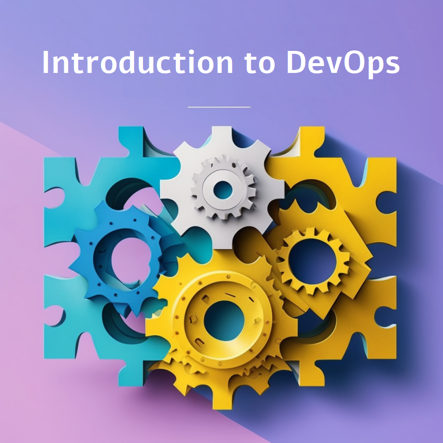
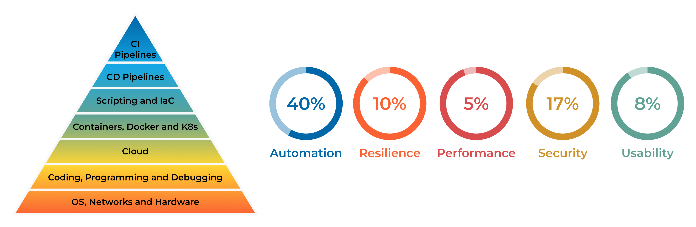

##################################
Welcome to Introduction to DevOps!
##################################

==========================
Or, the Art of Not Failing
==========================

.. note::

   A good DevOps engineer is a jack of all trades and a master of one.

++++++++++++++++++++++++++++++++++++++++++
Specialist vs. Generalist: Finding Balance
++++++++++++++++++++++++++++++++++++++++++

The debate between being a specialist or a generalist is never-ending. The reality? You need to be both. In DevOps, this means being a specialist in one area while maintaining a broad understanding of others. It's about seeing the big picture while mastering specific skills that contribute to the overall success of your projects.

Being both a specialist and a generalist means understanding how everything works together and how your work impacts others. It requires teamwork, communication, and the ability to share knowledge effectively. Most importantly, it requires a mindset of continuous learning and adaptability.

Here's what you'll need to excel as a DevOps engineer:

- The ability to automate repetitive tasks.
- Proficiency in debugging and testing systems.
- Strong documentation skills to create user-friendly guides.
- The ability to monitor and improve performance, security, and scalability.
- A craftsman's dedication to quality, with a focus on resilience and efficiency.

+++++++++++++++++++++++++++++++++++++
The T-shaped Skillset: Broad and Deep
+++++++++++++++++++++++++++++++++++++

In DevOps, success often requires a **T-shaped skillset**:

- **Broad Knowledge**: A general understanding across multiple areas of expertise.
- **Deep Knowledge**: Mastery of one specific domain.

This balance allows you to contribute effectively in cross-functional teams, solve complex problems, and drive continuous improvement across systems.

+++++++++++++++++++++++++++++++++++++++++++
Key Areas of Knowledge for DevOps Engineers
+++++++++++++++++++++++++++++++++++++++++++

To become an efficient DevOps engineer, you must develop proficiency in the following areas:

1. **Understanding Environments**: Learn about bare metal servers, virtual machines, containers, pods, and cloud environments - cloud native vs cloud agnostic. Understand their differences, use cases, and best practices.
2. **Linux and Terminal Skills**: Administer, manage, debug, and utilize Linux systems. Master the terminal for efficient system interactions. Almost everything runs on Linux, so knowing how to use, debug, and troubleshoot it is essential.
3. **Version Control with Git**: Collaborate effectively within teams by sharing and versioning code using Git.
4. **Documentation**: Write clear and concise documentation that simplifies complex processes for others.
5. **Automation and Scripting**: Automate repetitive tasks using scripting languages and tools.
6. **Testing and Problem Solving**: Test your systems thoroughly and identify potential problems before they occur.
7. **Continuous Improvement**: Always question the status quo. Focus on improving security, scalability, resilience, and performance in all areas.

+++++++++++++++++++++++++++++++++++++++++++++++
The DevOps Mindset: Adapt, Collaborate, Improve
+++++++++++++++++++++++++++++++++++++++++++++++

DevOps isn't just a role, it's a culture and a mindset. It's about being resilient in the face of challenges, recovering quickly from failures, and constantly striving for improvement. 
A DevOps engineer isn't just an expert in tools (languages, frameworks, applications, infrastructure),  they're a team player, a problem solver, and a continuous learner. By mastering the art of balancing width and depth, you'll not only excel in your career but also contribute to building better, faster, and more reliable systems.

.. toctree::
   :hidden:
   :titlesonly:
   :caption: Curriculum

   00_curriculum/curriculum

.. toctree::
   :hidden:
   :titlesonly:
   :caption: Introduction to DevOps

   0_introduction/0_foreword
   0_introduction/00_preface
   0_introduction/1_devops
   0_introduction/2_roadmap
   0_introduction/3_life_cycle
   0_introduction/4_scrum_agile
   0_introduction/TODO

.. toctree::
   :hidden:
   :titlesonly:
   :caption: System Design

   1_system_design/0_computer_network
   1_system_design/1_how_code_works.rst