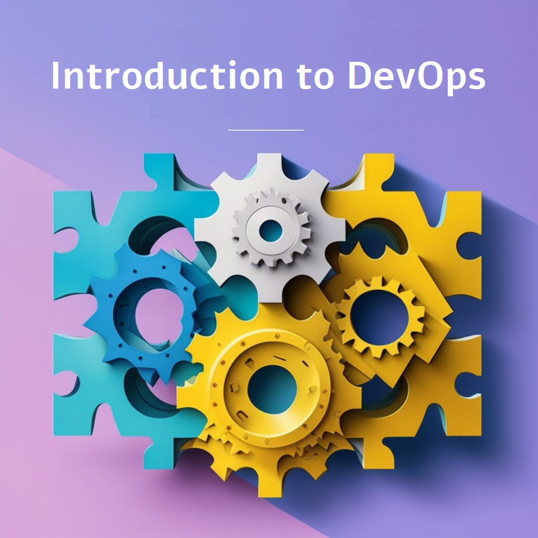
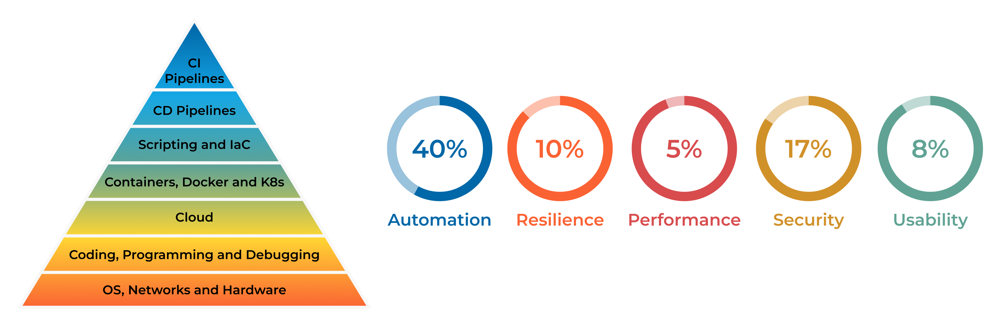

##################################
Welcome to Introduction to DevOps!
##################################

==========================
Or, the Art of Not Failing
==========================

.. note::

   A good DevOps engineer is a jack of all trades and a master of one.

++++++++++++++++++++++++++++++++++++++++++
Specialist vs. Generalist: Finding Balance
++++++++++++++++++++++++++++++++++++++++++

The debate between being a specialist or a generalist is never-ending. The reality? You need to be both. In DevOps, this means being a specialist in one area while maintaining a broad understanding of others. It's about seeing the big picture while mastering specific skills that contribute to the overall success of your projects.

Being both a specialist and a generalist means understanding how everything works together and how your work impacts others. It requires teamwork, communication, and the ability to share knowledge effectively. Most importantly, it requires a mindset of continuous learning and adaptability.

Here's what you'll need to excel as a DevOps engineer:

- The ability to automate repetitive tasks.
- Proficiency in debugging and testing systems.
- Strong documentation skills to create user-friendly guides.
- The ability to monitor and improve performance, security, and scalability.
- A craftsman's dedication to quality, with a focus on resilience and efficiency.

+++++++++++++++++++++++++++++++++++++
The T-shaped Skillset: Broad and Deep
+++++++++++++++++++++++++++++++++++++

In DevOps, success often requires a **T-shaped skillset**:

- **Broad Knowledge**: A general understanding across multiple areas of expertise.
- **Deep Knowledge**: Mastery of one specific domain.

This balance allows you to contribute effectively in cross-functional teams, solve complex problems, and drive continuous improvement across systems.

+++++++++++++++++++++++++++++++++++++++++++
Key Areas of Knowledge for DevOps Engineers
+++++++++++++++++++++++++++++++++++++++++++

To become an efficient DevOps engineer, you must develop proficiency in the following areas:

1. **Understanding Environments**: Learn about bare metal servers, virtual machines, containers, pods, and cloud environments - cloud native vs cloud agnostic. Understand their differences, use cases, and best practices.
2. **Linux and Terminal Skills**: Administer, manage, debug, and utilize Linux systems. Master the terminal for efficient system interactions. Almost everything runs on Linux, so knowing how to use, debug, and troubleshoot it is essential.
3. **Version Control with Git**: Collaborate effectively within teams by sharing and versioning code using Git.
4. **Documentation**: Write clear and concise documentation that simplifies complex processes for others.
5. **Automation and Scripting**: Automate repetitive tasks using scripting languages and tools.
6. **Testing and Problem Solving**: Test your systems thoroughly and identify potential problems before they occur.
7. **Continuous Improvement**: Always question the status quo. Focus on improving security, scalability, resilience, and performance in all areas.

+++++++++++++++++++++++++++++++++++++++++++++++
The DevOps Mindset: Adapt, Collaborate, Improve
+++++++++++++++++++++++++++++++++++++++++++++++

DevOps isn't just a role, it's a culture and a mindset. It's about being resilient in the face of challenges, recovering quickly from failures, and constantly striving for improvement. 
A DevOps engineer isn't just an expert in tools (languages, frameworks, applications, infrastructure),  they're a team player, a problem solver, and a continuous learner. By mastering the art of balancing width and depth, you'll not only excel in your career but also contribute to building better, faster, and more reliable systems.

.. toctree::
   :hidden:
   :titlesonly:
   :caption: Curriculum

   00_curriculum/curriculum

.. toctree::
   :hidden:
   :titlesonly:
   :caption: Introduction to DevOps

   0_introduction/0_foreword
   0_introduction/00_preface
   0_introduction/1_devops
   0_introduction/2_roadmap
   0_introduction/3_life_cycle
   0_introduction/4_scrum_agile
   0_introduction/TODO

.. toctree::
   :hidden:
   :titlesonly:
   :caption: Environments

   1_system_design/0_computer_network
   1_system_design/1_how_code_works.rst
   1_system_design/2_environments
   1_system_design/3_microservices
   1_system_design/4_introduction_to_linux
   1_system_design/5_getting_around
   1_system_design/6_setup_infra
   1_system_design/7_system_design.rst
   1_system_design/TODO

.. toctree::
   :hidden:
   :titlesonly:
   :caption: Pipelines

   7_pipelines/0_introduction
   7_pipelines/1_getting_started
   7_pipelines/2_python_cli
   7_pipelines/3_github
   7_pipelines/4_best_practices
   7_pipelines/TODO
   7_pipelines/ANSWERS

.. toctree::
   :hidden:
   :titlesonly:
   :caption: Containers

   8_containers/0_introduction
   8_containers/1_installation
   8_containers/2_helloworld
   8_containers/3_workingwithdocker
   8_containers/4_usingdockerfile
   8_containers/4.5_container_registries
   8_containers/5_management
   8_containers/6_orchestration
   8_containers/7_test
   8_containers/8_best_practices
   8_containers/9_run_llm_locally
   8_containers/TODO
   8_containers/ANSWERS

.. toctree::
   :hidden:
   :titlesonly:
   :caption: Kubernetes

   9_kubernetes/0_introduction
   9_kubernetes/1_gettingstarted
   9_kubernetes/1_installing_k3s_and_rancher
   9_kubernetes/2_core_concepts
   9_kubernetes/3_workloads_and_scheduling
   9_kubernetes/4_networking_and_services
   9_kubernetes/5_storage_and_persistence
   9_kubernetes/6_configuration_management
   9_kubernetes/7_security_and_rbac
   9_kubernetes/8_observability_and_monitoring
   9_kubernetes/9_helm_package_management
   9_kubernetes/10_gitops_with_argocd
   9_kubernetes/11_production_best_practices
   9_kubernetes/12_troubleshooting_and_debugging
   9_kubernetes/13_kubernetes_operators
   9_kubernetes/14_cicd_integration
   9_kubernetes/15_service_mesh
   9_kubernetes/16_advanced_networking
   9_kubernetes/TODO
   9_kubernetes/ANSWERS

.. toctree::
   :hidden:
   :titlesonly:
   :caption: Infrastructure as Code

   10_infrastructure_as_code/0_introduction_iac
   10_infrastructure_as_code/1_terraform_introduction
   10_infrastructure_as_code/2_terraform_core_concepts
   10_infrastructure_as_code/3_terraform_workflow_gcp
   10_infrastructure_as_code/4_terraform_production_challenges
   10_infrastructure_as_code/6_ansible_introduction
   10_infrastructure_as_code/7_ansible_core_concepts
   10_infrastructure_as_code/8_ansible_advanced_features
   10_infrastructure_as_code/9_ansible_production_patterns

.. toctree::
   :hidden:
   :titlesonly:
   :caption: Cloud

   11_cloud/0.1_what_is_cloud
   11_cloud/0.2_deployment_models
   11_cloud/0.3_cloud_vs_onpremises
   11_cloud/0.4_cloud_benefits
   11_cloud/0.5_service_models
   11_cloud/0.6_cloud_providers
   11_cloud/0.7_cloud_migration
   11_cloud/0.8_cloud_security
   11_cloud/0.9_finops_cost_management
   11_cloud/0.10_monitoring_observability
   11_cloud_gcp/0_introduction
   11_cloud_gcp/1_iam
   11_cloud_gcp/2_networking
   11_cloud_gcp/3_compute_services_overview
   11_cloud_gcp/4_compute_engine
   11_cloud_gcp/5_cloud_storage
   11_cloud_gcp/6_serverless
   11_cloud_gcp/7_gke
   11_cloud_gcp/8_finops
   11_cloud_gcp/9_security
   11_cloud_gcp/10_database_services

.. toctree::
   :hidden:
   :titlesonly:
   :caption: Project

   12_project/introduction